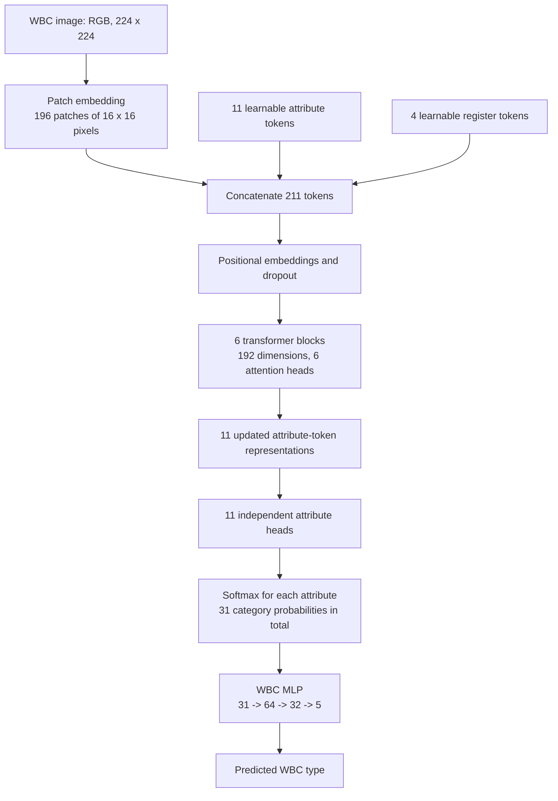
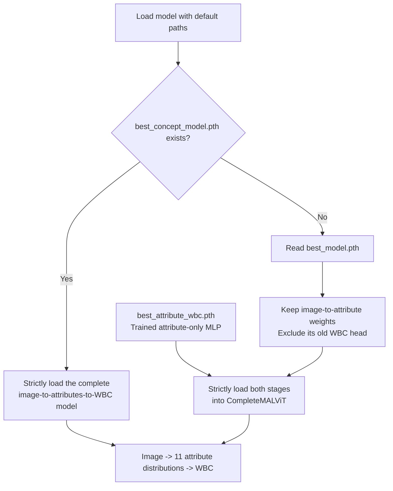
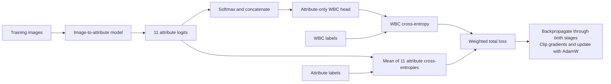
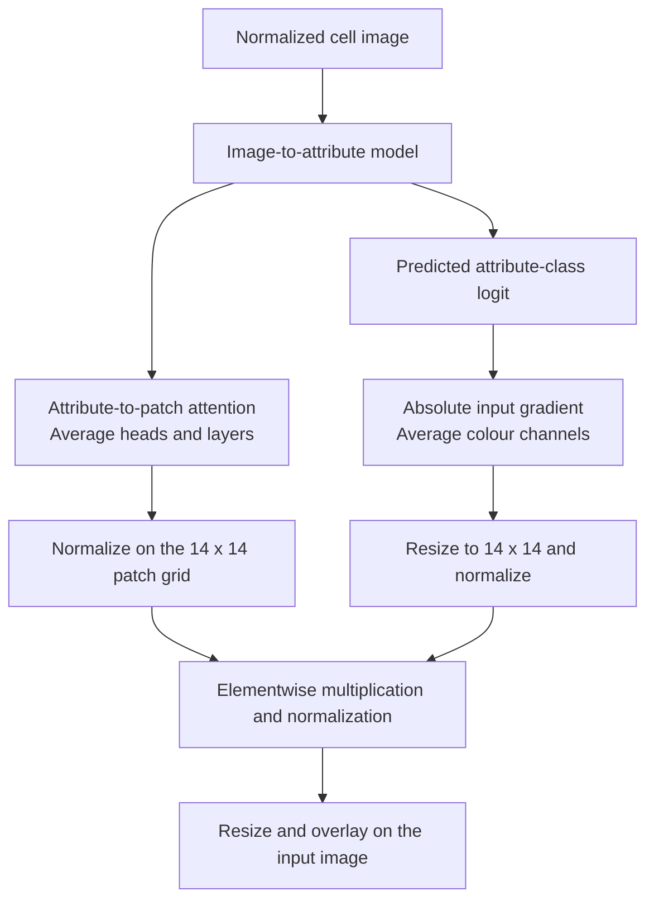

# WBC Morphology Analysis with a MAL-ViT-Inspired Model


**Predict 11 morphology attributes from a white blood cell image, then use those attribute predictions to classify the WBC type.**

This project implements an attribute-based Vision Transformer in PyTorch, with training, evaluation, single-image inference, and a Streamlit interface. Its WBC classifier receives the predicted morphology distributions rather than image features directly.

This is an independent educational and research implementation inspired by MAL-ViT's attribute-token approach. It adds a downstream attribute-to-WBC classifier. It is not an exact implementation or reproduction of the original paper; the architecture and results documented here describe this project's code.

**Existing trained weights can be used without retraining.** See the [GUI and application integration guide](docs/USAGE.md) and [verification record](docs/VERIFICATION.md).

## Contents

- [Model architecture](#model-architecture)
- [Morphology attributes and WBC classes](#morphology-attributes-and-wbc-classes)
- [Checkpoints and model loading](#checkpoints-and-model-loading)
- [Dataset and preprocessing](#dataset-and-preprocessing)
- [Setup and quick start](#setup-and-quick-start)
- [Training](#training)
- [Evaluation and verified results](#evaluation-and-verified-results)
- [Streamlit app and explainability](#streamlit-app-and-explainability)
- [Use in another application without retraining](#use-in-another-application-without-retraining)
- [Python API](#python-api)
- [Repository guide](#repository-guide)
- [Tests](#tests)
- [Limitations](#limitations)
- [References and acknowledgements](#references-and-acknowledgements)
- [Author](#author)

## Model architecture

The complete model is [CompleteMALViT](models/complete_model.py). It extends the image-to-attribute backbone in [MALViT](models/mal_vit.py) with the attribute-only [WBCClassifier](models/wbc_classifier.py).



Each attribute token supplies its own prediction head. Register tokens participate in transformer attention and provide additional learned context. The final WBC head has **no direct connection to patch features, register features, or the image**.

The eleven attributes have different numbers of categories. Their probability distributions are concatenated into a **31-value vector**. This is an encoding of 11 attributes, not 31 separate attributes. Both joint training and automatic inference use this same soft representation. The attribute labels displayed to the user are the highest-probability categories; the classifier uses the full distributions.

| Component | Current configuration |
|---|---|
| Image input | RGB, `224 x 224` |
| Patch embedding | Convolution with kernel and stride `16` |
| Patch tokens | `196`, arranged as a `14 x 14` grid |
| Token order | 11 attribute tokens, 4 register tokens, 196 patch tokens |
| Sequence length | `211` |
| Embedding dimension | `192` |
| Transformer | 6 pre-normalization blocks, 6 attention heads per block |
| Transformer MLP | `192 -> 768 -> 192`, GELU |
| Backbone dropout | `0.10` |
| Attribute heads | One linear classifier per attribute |
| WBC head | `31 -> 64 -> 32 -> 5`, ReLU and dropout `0.20` |

Architecture defaults are in [config.py](config.py); the WBC head is defined in [models/wbc_classifier.py](models/wbc_classifier.py).

## Morphology attributes and WBC classes

[data/encoders.py](data/encoders.py) defines the attribute order, category indices, and WBC label mapping. The values below appear in encoding order.

| Attribute | Categories | Count |
|---|---|---:|
| `cell_size` | big, small | 2 |
| `cell_shape` | round, irregular | 2 |
| `nucleus_shape` | segmented-bilobed, unsegmented-band, unsegmented-indented, segmented-multilobed, unsegmented-round, irregular | 6 |
| `nuclear_cytoplasmic_ratio` | low, high | 2 |
| `chromatin_density` | densely, loosely | 2 |
| `cytoplasm_vacuole` | no, yes | 2 |
| `cytoplasm_texture` | clear, frosted | 2 |
| `cytoplasm_colour` | light blue, blue, purple blue | 3 |
| `granule_type` | small, round, nil, coarse | 4 |
| `granule_colour` | pink, red, nil, purple | 4 |
| `granularity` | yes, no | 2 |
| **Total category values** | | **31** |

The five WBC output classes are:

| Index | WBC type |
|---:|---|
| 0 | Neutrophil |
| 1 | Eosinophil |
| 2 | Monocyte |
| 3 | Basophil |
| 4 | Lymphocyte |

Changing category order changes the meaning of model inputs and outputs. Keep the encoders and checkpoint metadata aligned.

## Checkpoints and model loading

All image-based inference and evaluation entry points use [utils/model_loading.py](utils/model_loading.py). There are two supported ways to obtain the same sequential architecture.



| File in `outputs/checkpoints/` | Role |
|---|---|
| `best_model.pth` | Existing image model. Its backbone and 11 attribute heads are reused; its older image-feature WBC head is excluded. |
| `best_attribute_wbc.pth` | Separately trained attribute-to-WBC classifier, used with the existing image model. |
| `best_concept_model.pth` | Complete sequential model saved by current joint training when validation loss improves. |
| `last_concept_checkpoint.pth` | Complete training state from the latest epoch of current joint training. |

### How the existing stages were trained

The existing `best_model.pth` was trained with morphology supervision alongside an older WBC classifier. The existing `best_attribute_wbc.pth` was trained separately on **ground-truth categorical attributes**, encoded as one-hot vectors. They were not originally trained together as the current sequential pipeline.

The shared loader combines their compatible weights in memory. The resulting model supplies **predicted attribute probabilities** to the WBC head. This difference from the head's original one-hot training input is a reason to evaluate the combined pipeline separately and, if needed, fine-tune both stages together.

Loading requires matching parameter names and shapes. Available label metadata is checked, and missing or incompatible weights raise an error rather than leaving a random classifier in use. The original checkpoints predate the label-metadata fields written by the current training code.

New joint training uses separate filenames, retaining the original two artifacts. New checkpoints include model, optimizer, scheduler, epoch, validation loss, training history, architecture, and label metadata. If a complete concept checkpoint exists but is incompatible, loading fails instead of silently falling back to the older files.

## Dataset and preprocessing

The project uses morphology annotations from [WBCAtt](https://rose1.ntu.edu.sg/dataset/WBCAtt/) and the corresponding PBC images. WBCAtt annotates 11 attributes for 10,298 WBC images.

The local CSV splits used for the recorded evaluation are:

| Split | Configured annotation file | Images |
|---|---|---:|
| Training | `pbc_attr_v1_train.csv` | 6,169 |
| Validation | `pbc_attr_v1_val.csv` | 1,030 |
| Test | `test.csv` | 3,099 |
| **Total** | | **10,298** |

Place the data under the default layout, or update the paths in [config.py](config.py):

```text
 datasets/WBCAtt/
 |-- annotations/
 |   |-- pbc_attr_v1_train.csv
 |   |-- pbc_attr_v1_val.csv
 |   `-- test.csv
 `-- PBC_dataset_normal_DIB/
     |-- basophil/
     |-- eosinophil/
     |-- lymphocyte/
     |-- monocyte/
     `-- neutrophil/
```

The WBCAtt release names its test annotations `pbc_attr_v1_test.csv`; this project currently expects `test.csv`. Either use the configured filename or change `TEST_CSV`. Download the annotations and matching images through the dataset providers; `datasets/` is excluded from version control.

Required CSV columns are `path`, `img_name`, `label`, and the 11 attribute names above. Images are resolved from the CSV `path` relative to the dataset root, with a fallback under `PBC_dataset_normal_DIB`.

| Stage | Transformations |
|---|---|
| Training | Bicubic resize to `224 x 224`, random horizontal flip, rotation up to 15 degrees, colour jitter, tensor conversion, normalization |
| Validation, test, inference, app | Bicubic resize to `224 x 224`, tensor conversion, normalization |

Normalization uses ImageNet mean `(0.485, 0.456, 0.406)` and standard deviation `(0.229, 0.224, 0.225)`. These normalization constants do not imply that the backbone uses ImageNet-pretrained weights.

The collated batch contains `images` with shape `(B, 3, 224, 224)`, `labels` with shape `(B,)`, and categorical `attributes` with shape `(B, 11)`, plus sample metadata.

## Setup and quick start

Run commands from the repository root. Python 3.11 is the development environment used for this project.

```bash
git clone https://github.com/fassi182/wbc-morphology-analysis-mal-vit.git
cd wbc-morphology-analysis-mal-vit
python -m venv .venv
```

Activate the environment on Windows PowerShell:

```powershell
.\.venv\Scripts\Activate.ps1
```

Or on Linux/macOS:

```bash
source .venv/bin/activate
```

Install the dependencies:

```bash
python -m pip install -r requirements.txt
```

For prediction without the GUI or training tools, install `requirements-inference.txt` instead. Use `requirements-dev.txt` for the complete environment including pytest. The full requirements constrain pandas below version 3 for compatibility with the tested Streamlit version.

The code uses CUDA when available and CPU otherwise. Single-image inference and the app need trained checkpoints, but do not need the full dataset. Training and dataset evaluation need all three configured CSV files and their images.

With either the existing pair of checkpoints or a complete concept checkpoint in place:

```bash
python inference.py --image images/BA_1223.jpg
python -m streamlit run app.py
```

To select a different complete checkpoint explicitly:

```bash
python inference.py --image images/BA_1223.jpg --checkpoint outputs/checkpoints/best_concept_model.pth
```

## Training

### Joint image-to-attributes-to-WBC training

Train both stages from scratch:

```bash
python train.py
```

Or initialize from the default loader's existing weights and fine-tune both stages:

```bash
python train.py --initialize-from-existing
```

This initializes a **new optimization run** with the loaded weights; it does not resume the stored optimizer, scheduler, or epoch counter. If `best_concept_model.pth` already exists, its weights take precedence over the original checkpoint pair.

Supported overrides include:

```bash
python train.py --initialize-from-existing --epochs 20 --batch-size 16 --output-dir outputs/finetune_run
```

`--output-dir` controls where the new checkpoints are saved. It does not change which weights are loaded for initialization or the app's default checkpoint location. Use `--checkpoint` for CLI evaluation/inference of a custom run, or pass it after `--` when launching the GUI.



The default loss is:

```text
attribute_loss = mean(cross_entropy(attribute_logits[i], attribute_label[i]))
total_loss = 1.0 * wbc_loss + 1.0 * attribute_loss
```

Attribute and WBC cross-entropies are unweighted by class frequency. The soft bottleneck allows WBC loss gradients to flow back through all attribute heads and the image model.

| Setting | Default |
|---|---:|
| Epoch limit | 30 |
| Batch size | 32 |
| Optimizer | AdamW |
| Learning rate | `3e-4` |
| Weight decay | `1e-4` |
| Scheduler | Linear warmup, then cosine decay |
| Warmup | 5 epochs; shortened for short runs |
| Minimum learning rate | `1e-6` |
| Gradient clipping norm | `1.0` |
| Early stopping | Validation total loss; patience 10, minimum improvement `1e-4` |
| Random seed | 42 |
| Data-loader workers | 0 |

Training prints epoch metrics and stores history in the checkpoints. The best model is selected using validation total loss. Test evaluation is a separate command.

### Optional attribute-only training

```bash
python -m training.train_attribute_wbc
```

This trains the shared WBC MLP using the CSV's ground-truth attributes and WBC labels. It does not train the image backbone. The current implementation reuses the image data loaders, so it still requires the image files.

Its own defaults are 50 epochs, AdamW at `1e-3`, weight decay `1e-4`, and early-stopping patience 8. It selects `best_attribute_wbc.pth` by validation accuracy and then reports test accuracy using ground-truth attributes. That score is distinct from complete image-to-WBC performance.

## Evaluation and verified results

Evaluate the complete image-based pipeline:

```bash
python test.py --output outputs/concept_test_results.json
```

Evaluate a checkpoint saved in a custom run directory:

```bash
python test.py --checkpoint outputs/finetune_run/best_concept_model.pth --output outputs/finetune_test_results.json
```

Additional diagnostics:

```bash
python evaluate_attributes.py
python -m training.validate
```

`evaluate_attributes.py` reports per-attribute classification metrics, confusion matrices, and accuracy relative to a majority-class baseline. It uses the default checkpoint loader. The validation module evaluates the validation split.

### Recorded image-based evaluation

The saved [evaluation report](outputs/concept_test_results.json) covers **3,099 test images** using the original image-to-attribute weights from `best_model.pth` and the attribute-only head from `best_attribute_wbc.pth`. It uses normalized images and predicted attribute probabilities. No joint fine-tuning was performed for this recorded result.

| Metric | Result |
|---|---:|
| WBC accuracy | **97.64%** |
| Macro precision | 96.93% |
| Macro recall | 96.77% |
| Macro F1 | **96.77%** |
| Total test loss | 0.3523 |
| WBC loss | 0.1143 |
| Mean attribute loss | 0.2380 |

| WBC class | Precision | Recall | F1 | Test samples |
|---|---:|---:|---:|---:|
| Neutrophil | 99.40% | 98.02% | 98.71% | 1,011 |
| Eosinophil | 99.68% | 99.89% | 99.78% | 927 |
| Monocyte | 89.98% | 98.88% | 94.22% | 445 |
| Basophil | 97.69% | 96.85% | 97.27% | 349 |
| Lymphocyte | 97.93% | 90.19% | 93.90% | 367 |

| Morphology attribute | Test accuracy |
|---|---:|
| Cell size | 75.22% |
| Cell shape | 80.67% |
| Nucleus shape | 64.73% |
| Nuclear-cytoplasmic ratio | 97.87% |
| Chromatin density | 94.61% |
| Cytoplasm vacuole | 94.51% |
| Cytoplasm texture | 94.58% |
| Cytoplasm colour | 90.84% |
| Granule type | 98.52% |
| Granule colour | 98.16% |
| Granularity | 98.97% |

These numbers describe the local dataset split and the recorded checkpoint combination. They are not results for a newly fine-tuned model or an external dataset. High WBC accuracy does not establish equally strong performance for every morphology attribute.

## Streamlit app and explainability

Start the interface with `python -m streamlit run app.py`, upload a JPG/JPEG/PNG cell image, and select **Analyze WBC**.

To select a complete checkpoint explicitly, including the exported model described below:

```bash
python -m streamlit run app.py -- --checkpoint outputs/wbc_inference.pth
```

Restart the app after replacing checkpoint files so its cached model is reloaded. See the [usage guide](docs/USAGE.md) for setup, upload steps, and troubleshooting.

The app displays:

1. The uploaded image and its dimensions.
2. Eleven morphology predictions and expandable category probabilities.
3. The WBC type derived from those attribute distributions.
4. Per-attribute attention, input-gradient, and combined explanation maps.

[utils/xai/vit_grad_cam.py](utils/xai/vit_grad_cam.py) explains the predicted class of each morphology attribute:



The combined maps are custom **attention-gradient attribution maps**. Although legacy function and output names include `cam` or `gradcam`, this is not standard Grad-CAM or attention rollout. These maps explain attribute predictions, not a direct attribution of the final WBC decision.

To generate example overlays from the first alphabetically sorted image in `images/`:

```bash
python -m utils.xai.vit_grad_cam
```

This writes attention, gradient, and combined overlays under `outputs/xai/`. Generating explanations performs a gradient pass for each of the 11 attributes, so it takes longer than prediction alone.

## Use in another application without retraining

Load the model once, then pass an image path, a PIL image, or encoded image bytes:

```python
from wbc_predictor import WBCPredictor

predictor = WBCPredictor(device="cpu")
result = predictor.predict("images/BA_1223.jpg")
print(result["attributes"])
print(result["wbc"], result["wbc_confidence"])
```

Run this from the repository root or make that directory importable. This source repository is not currently an installable Python package. The [integration guide](docs/USAGE.md) explains how to use it from another application and lists the minimal deployment files.

Package the existing trained stages into one inference checkpoint:

```bash
python export_model.py --output outputs/wbc_inference.pth
python examples/predict_in_app.py --image images/BA_1223.jpg --checkpoint outputs/wbc_inference.pth
```

Exporting performs no training and refuses to overwrite an existing file. If the export already exists, use it or choose another output filename. Load it with `WBCPredictor(checkpoint_path="outputs/wbc_inference.pth", device="cpu")`. It requires the model source and inference dependencies, but neither the dataset nor the original checkpoint pair.

## Python API

```python
from inference import predict_details
from utils.model_loading import load_model

model = load_model()
result = predict_details("images/BA_1223.jpg", model=model)

print(result["attributes"])
print(result["attribute_probabilities"])
print(result["wbc"], result["wbc_confidence"])
```

`CompleteMALViT` also exposes:

| Method | Purpose |
|---|---|
| `extract_attributes(images)` | Predict morphology without invoking the WBC head |
| `classify_attribute_predictions(predictions)` | Convert the eleven logit tensors to probabilities and classify WBC |
| `forward(images)` | Execute both stages in sequence |
| `classify_approved_attributes(indices)` | Classify supplied categorical attribute indices using one-hot encoding |

The optional intervention method accepts an integer tensor of shape `(B, 11)` or a dictionary of per-attribute index tensors. Inputs must use the encoder order and the model's device. The app currently performs automatic inference; it does not provide a human attribute-editing workflow.

## Repository guide

| Path | Responsibility |
|---|---|
| [config.py](config.py) | Dataset/checkpoint paths and model/training defaults |
| [data/](data/) | CSV dataset, label encoders, transforms, batching, and statistics |
| [models/mal_vit.py](models/mal_vit.py) | Image-to-attribute transformer backbone |
| [models/complete_model.py](models/complete_model.py) | Complete sequential model |
| [models/wbc_classifier.py](models/wbc_classifier.py) | Shared attribute-vector-to-WBC MLP |
| [models/attribute_wbc_classifier.py](models/attribute_wbc_classifier.py) | Categorical-input wrapper for independent head training |
| [train.py](train.py) | Joint training CLI |
| [training/engine.py](training/engine.py) | Training/validation steps and sample-weighted epoch metrics |
| [training/runner.py](training/runner.py) | Epoch orchestration, history, checkpointing, and early stopping |
| [training/losses.py](training/losses.py) | Shared multi-task loss |
| [training/train_attribute_wbc.py](training/train_attribute_wbc.py) | Independent attribute-to-WBC head training |
| [test.py](test.py) | Complete test-set evaluation CLI |
| [evaluate_attributes.py](evaluate_attributes.py) | Attribute diagnostics and majority baselines |
| [inference.py](inference.py) | Single-image prediction API and CLI |
| [wbc_predictor.py](wbc_predictor.py) | Load-once application API for image paths, PIL images, and bytes |
| [export_model.py](export_model.py) | Export trained stages as one inference checkpoint without retraining |
| [examples/predict_in_app.py](examples/predict_in_app.py) | Runnable integration example |
| [docs/USAGE.md](docs/USAGE.md) | GUI instructions, deployment files, and application integration |
| [docs/VERIFICATION.md](docs/VERIFICATION.md) | Audit evidence and remaining limitations |
| [app.py](app.py) | Streamlit interface |
| [utils/model_loading.py](utils/model_loading.py) | Strict loading and composition of trained stages |
| [utils/checkpoint_manager.py](utils/checkpoint_manager.py) | Training checkpoint serialization |
| [utils/xai/](utils/xai/) | Attribute explanation maps |
| [tests/](tests/) | Regression tests and executable integration checks |
| [images/](images/) | Example inputs |
| [outputs/](outputs/) | Checkpoints, saved evaluation results, and visualizations |

## Tests

Install the development dependencies and run the regression suite:

```bash
python -m pip install -r requirements-dev.txt
python -m pytest -q
```

The suite checks attribute-only WBC inputs, independence from image features when attributes are fixed, gradient flow through the attributes, categorical interventions, checkpoint compatibility, preprocessing consistency, and training/evaluation interfaces.

The final verification passed **34 regression tests**. See the [verification record](docs/VERIFICATION.md) for the GUI checks, portable trained inference, real-data training/validation check, and full test-set evaluation. Older integration scripts are executable modules rather than automatically collected pytest test functions. For example:

```bash
python -m tests.training_pipeline_test
```

That integration check requires the local dataset and updates a temporary in-memory model; it does not save trained weights.

## Limitations

- The current evaluation is on one local WBCAtt/PBC split. Generalization to other acquisition settings has not been established here.
- Some attributes, especially nucleus shape and cell size, have substantially lower accuracy than the final WBC classifier.
- Attribute classes are imbalanced, and the current losses do not apply class-frequency weights. Inspect per-class metrics and majority baselines alongside accuracy.
- The existing standalone head was trained on one-hot ground-truth attributes; the composed image pipeline supplies predicted probabilities.
- Attribute probabilities and explanation overlays support inspection, but do not prove that every prediction is correct or that the explanations are causal.
- This is a five-class WBC classifier. It has no explicit unknown-cell or out-of-distribution rejection class.
- The repository is an educational research project, not a clinically validated diagnostic system.

Further work can evaluate joint fine-tuning, improve weaker attribute heads, compare pretrained backbones, assess probability calibration, and test on external datasets.

## References and acknowledgements

- [WBCAtt: White Blood Cell Attribute Dataset](https://rose1.ntu.edu.sg/dataset/WBCAtt/) - dataset description, annotations, and attribution requirements. The dataset publication is *WBCAtt: A White Blood Cell Dataset Annotated with Detailed Morphological Attributes*, Satoshi Tsutsui, Winnie Pang, and Bihan Wen, NeurIPS 2023.
- [Multi-Attribute Vision Transformers are Efficient and Robust Learners](https://arxiv.org/abs/2402.08070) - Hanan Gani, Nada Saadi, Noor Hussein, and Karthik Nandakumar. This is the correct title of the arXiv paper previously linked by this repository. It studies multi-attribute learning on CelebA; it is related work, not a WBC-specific architecture or a benchmark reproduced here.

Thanks to the WBCAtt authors, ROSE Lab at Nanyang Technological University, and the PBC dataset creators. Follow the dataset providers' attribution instructions when using their data in publications.

## Author

**Muhammad Fassi Ur Rehman**

BS Artificial Intelligence, COMSATS University Islamabad

Project repository: [fassi182/wbc-morphology-analysis-mal-vit](https://github.com/fassi182/wbc-morphology-analysis-mal-vit)
