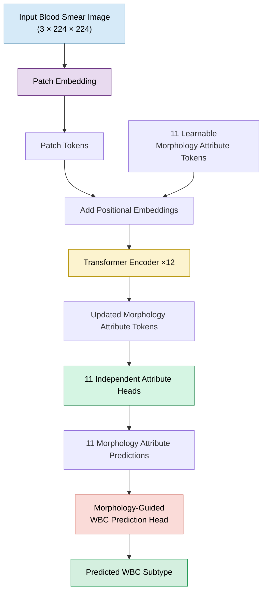
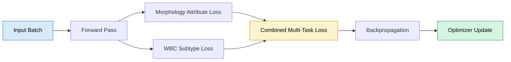
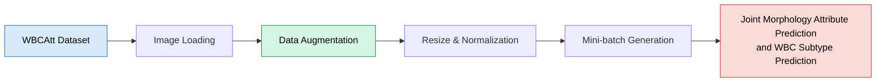
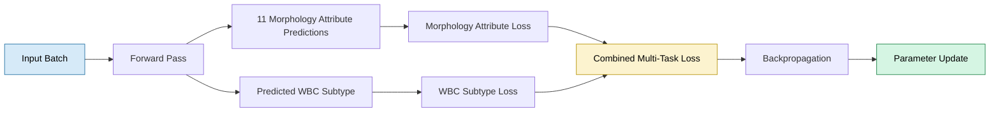

# 🩸 WBC Morphology Analysis with a MAL-ViT Inspired Architecture

<p align="center">


</p>

> **An educational PyTorch implementation inspired by the MAL-ViT paper for joint morphology attribute prediction and White Blood Cell (WBC) subtype prediction. The architecture learns 11 clinically meaningful morphology attribute predictions before using them in a Morphology-Guided WBC Prediction Head to infer the final WBC subtype.**

---

# 📖 Overview

White Blood Cell (WBC) morphology plays an important role in hematological diagnosis, as morphological characteristics often provide clinically relevant information beyond the final cell subtype alone.

Inspired by the **Morphology Attribute Learning Vision Transformer (MAL-ViT)**, this project adopts a **morphology-first learning strategy** in which the model first predicts **11 clinically meaningful morphology attributes** from a blood smear image. These intermediate morphology attribute predictions are then used by a **Morphology-Guided WBC Prediction Head** to predict the corresponding WBC subtype.

The project is implemented from scratch in **PyTorch** with a modular architecture that includes dataset preparation, model training, evaluation, checkpointing, and inference. It is designed as an educational implementation for understanding morphology-aware Vision Transformers while providing a solid foundation for future research and experimentation.

> **Implementation Note**
>
> This repository is an independent educational implementation inspired by the MAL-ViT paper. It follows the paper's overall design philosophy but is **not an official reproduction**, and some implementation details may differ from those described in the original publication.

---

# 📝 Implementation at a Glance

| Category | Details |
|-----------|---------|
| 📄 Inspiration | Morphology Attribute Learning Vision Transformer (MAL-ViT) |
| 🩸 Task | Joint Morphology Attribute Prediction and WBC Subtype Prediction |
| 🧬 Input | RGB Blood Smear Images (224 × 224) |
| 📊 Outputs | 11 Morphology Attribute Predictions + Predicted WBC Subtype |
| 🧠 Backbone | Vision Transformer (ViT-inspired) |
| 🎯 Learning Strategy | Multi-Task Learning |
| ➕ Project Extension | Morphology-Guided WBC Prediction Head |
| 🧪 Dataset | WBCAtt |
| ⚙️ Framework | PyTorch |

# ✨ Key Features

| Feature | Description |
|---------|-------------|
| 🧬 **Morphology-First Learning** | Predicts 11 clinically meaningful morphology attributes before inferring the final WBC subtype. |
| 🧠 **ViT-Inspired Architecture** | Implements the core design principles of MAL-ViT using a Vision Transformer backbone built in PyTorch. |
| 🏷️ **Learnable Morphology Attribute Tokens** | Uses dedicated attribute tokens that interact with image patches to learn morphology-aware representations. |
| 🎯 **Joint Multi-Task Learning** | Simultaneously optimizes morphology attribute prediction and WBC subtype prediction within a unified training framework. |
| ➕ **Morphology-Guided WBC Prediction Head** | Extends the original MAL-ViT architecture with a downstream prediction head that utilizes morphology attribute predictions to infer the final WBC subtype. |
| 🏗️ **Modular PyTorch Implementation** | Organized into reusable modules for patch embedding, attention, transformer blocks, prediction heads, training, and inference. |
| 📈 **End-to-End Training Pipeline** | Includes data preprocessing, augmentation, training, validation, testing, checkpointing, metric logging, and inference. |
| 🔬 **Research-Oriented Design** | Built to facilitate experimentation with morphology-aware representation learning, Vision Transformers, and medical image analysis. |

---

# 🏗️ End-to-End Pipeline

```mermaid
flowchart LR

A["Blood Smear Image"]

B["Image Preprocessing"]

C["Patch Embedding"]

D["11 Learnable<br/>Morphology Attribute Tokens"]

E["Transformer Encoder"]

F["11 Morphology Attribute Predictions"]

G["Morphology-Guided<br/>WBC Prediction Head"]

H["Predicted WBC Subtype"]

A --> B
B --> C
C --> D
D --> E
E --> F
F --> G
G --> H

style A fill:#D6EAF8,stroke:#2471A3,color:#000
style C fill:#E8DAEF,stroke:#6C3483,color:#000
style E fill:#FCF3CF,stroke:#B7950B,color:#000
style F fill:#D5F5E3,stroke:#1E8449,color:#000
style G fill:#FADBD8,stroke:#C0392B,color:#000
style H fill:#D4EFDF,stroke:#239B56,color:#000
```



---

# 🎯 Project Objectives

- Implement the core architectural concepts proposed in the MAL-ViT paper using PyTorch.
- Study morphology-aware representation learning with Vision Transformers.
- Jointly predict morphology attributes and WBC subtypes through a multi-task learning framework.
- Extend the original architecture with a **Morphology-Guided WBC Prediction Head**.
- Build a complete, modular, and reproducible deep learning pipeline for biomedical image analysis.

---

# 📂 What's Included

| Module | Status |
|---------|:------:|
| Patch Embedding | ✅ |
| Learnable Morphology Attribute Tokens | ✅ |
| Transformer Encoder | ✅ |
| Independent Morphology Attribute Heads | ✅ |
| Joint Multi-Task Learning | ✅ |
| Morphology-Guided WBC Prediction Head | ✅ |
| Training & Validation Pipeline | ✅ |
| Testing & Inference Pipeline | ✅ |

---

# 📚 Resources

| Resource | Link |
|----------|------|
| 📄 MAL-ViT Paper | https://arxiv.org/pdf/2402.08070v2 |
| 🧬 WBCAtt Dataset | https://rose1.ntu.edu.sg/dataset/WBCAtt/ |

---

# 📑 Repository Guide

- Architecture Overview
- Model Workflow
- Architecture Components
- Forward Pass
- Mathematical Formulation
- Dataset
- Training Strategy
- Results
- Repository Structure
- Installation Guide
- Future Work
- References

# 🏛️ Architecture Overview

The architecture follows the design philosophy of the **Morphology Attribute Learning Vision Transformer (MAL-ViT)** by replacing the conventional classification token with **11 learnable morphology attribute tokens**. These tokens interact with image patch tokens throughout the Transformer encoder to learn attribute-specific representations.

Instead of directly predicting a cell subtype from global image features, the network first generates **11 Morphology Attribute Predictions**. These intermediate predictions are then passed to a **Morphology-Guided WBC Prediction Head**, introduced as an extension in this project, to infer the **Predicted WBC Subtype**.

This two-stage design encourages morphology-aware representation learning while providing interpretable intermediate predictions that bridge image features and the final subtype prediction.

---

# 🔄 Model Workflow



---

# 🧩 Architecture Components

| Component | Purpose |
|-----------|---------|
| **Patch Embedding** | Splits the input image into fixed-size patches and projects them into embedding vectors. |
| **Morphology Attribute Tokens** | Eleven learnable tokens that capture morphology-specific representations during Transformer encoding. |
| **Positional Embeddings** | Preserve the spatial arrangement of image patches within the token sequence. |
| **Transformer Encoder** | Learns contextual relationships between image patches and morphology attribute tokens through self-attention. |
| **Independent Attribute Heads** | Produce the **11 Morphology Attribute Predictions** from the corresponding attribute tokens. |
| **Morphology-Guided WBC Prediction Head** | Uses the predicted morphology attribute representations to infer the **Predicted WBC Subtype**. |

---

# ⚙️ Forward Pass

```text
Input Blood Smear Image
           │
           ▼
     Patch Embedding
           │
           ▼
      Patch Tokens
           │
           ▼
+ 11 Morphology Attribute Tokens
           │
           ▼
    Positional Embeddings
           │
           ▼
  Transformer Encoder
           │
           ▼
Updated Morphology Attribute Tokens
           │
           ▼
11 Independent Attribute Heads
           │
           ▼
11 Morphology Attribute Predictions
           │
           ▼
Morphology-Guided WBC Prediction Head
           │
           ▼
Predicted WBC Subtype
```

---

# 📦 Dataset

This implementation is developed using the **WBCAtt** dataset, a publicly available White Blood Cell morphology dataset containing both **WBC subtype labels** and **11 morphology attribute annotations**.

Unlike conventional WBC classification datasets that provide only a cell label, WBCAtt enables the model to learn **clinically meaningful morphology attributes** alongside **WBC subtype prediction** within a unified multi-task learning framework.

| Property | Details |
|----------|---------|
| **Dataset** | WBCAtt |
| **Image Type** | Peripheral Blood Smear Images |
| **Input Resolution** | 224 × 224 RGB |
| **Intermediate Supervision** | 11 Morphology Attribute Labels |
| **Final Supervision** | WBC Subtype Labels |
| **Overall Task** | Joint Morphology Attribute Prediction and WBC Subtype Prediction |

### Dataset Resource

https://rose1.ntu.edu.sg/dataset/WBCAtt/

---

# 🧪 Data Pipeline

The data processing pipeline prepares blood smear images before they are passed to the Vision Transformer.


### Training Preprocessing

Training images undergo data augmentation to improve model robustness and generalization.

Typical augmentations include:

- Resize
- Random Horizontal Flip
- Random Rotation
- Color Jitter
- Image Normalization

Validation and test images use deterministic preprocessing without random augmentation.

---

# 🎯 Training Strategy

The proposed architecture is trained using a **multi-task learning** strategy.

During each forward pass, the network jointly optimizes two related objectives:

1. **Intermediate Task:** Predict the **11 Morphology Attribute Predictions**
2. **Final Task:** Predict the **WBC Subtype**

The two objectives are optimized simultaneously through a combined loss, encouraging the backbone to learn morphology-aware representations that benefit downstream subtype prediction.



The complete training pipeline includes:

| Stage | Included |
|--------|:--------:|
| Dataset Loading | ✅ |
| Image Preprocessing | ✅ |
| Data Augmentation | ✅ |
| Forward Pass | ✅ |
| Joint Multi-Task Loss | ✅ |
| Backpropagation | ✅ |
| Validation | ✅ |
| Testing | ✅ |
| Model Checkpointing | ✅ |
| Inference | ✅ |

Project hyperparameters—including optimizer, scheduler, learning rate, batch size, and training epochs—are configurable through the project configuration files.

---

---

# 📦 Dataset

This implementation is developed using the **WBCAtt** dataset, a publicly available White Blood Cell morphology dataset containing both **WBC subtype labels** and **11 morphology attribute annotations**.

Unlike conventional WBC classification datasets that provide only a cell label, WBCAtt enables the model to learn **clinically meaningful morphology attributes** alongside **WBC subtype prediction** within a unified multi-task learning framework.

| Property | Details |
|----------|---------|
| **Dataset** | WBCAtt |
| **Image Type** | Peripheral Blood Smear Images |
| **Input Resolution** | 224 × 224 RGB |
| **Intermediate Supervision** | 11 Morphology Attribute Labels |
| **Final Supervision** | WBC Subtype Labels |
| **Overall Task** | Joint Morphology Attribute Prediction and WBC Subtype Prediction |

### Dataset Resource

https://rose1.ntu.edu.sg/dataset/WBCAtt/

---

# 🧪 Data Pipeline

The data processing pipeline prepares blood smear images before they are passed to the Vision Transformer.


### Training Preprocessing

Training images undergo data augmentation to improve model robustness and generalization.

Typical augmentations include:

- Resize
- Random Horizontal Flip
- Random Rotation
- Color Jitter
- Image Normalization

Validation and test images use deterministic preprocessing without random augmentation.

---

# 🎯 Training Strategy

The proposed architecture is trained using a **multi-task learning** strategy.

During each forward pass, the network jointly optimizes two related objectives:

1. **Intermediate Task:** Predict the **11 Morphology Attribute Predictions**
2. **Final Task:** Predict the **WBC Subtype**

The two objectives are optimized simultaneously through a combined loss, encouraging the backbone to learn morphology-aware representations that benefit downstream subtype prediction.


The complete training pipeline includes:

| Stage | Included |
|--------|:--------:|
| Dataset Loading | ✅ |
| Image Preprocessing | ✅ |
| Data Augmentation | ✅ |
| Forward Pass | ✅ |
| Joint Multi-Task Loss | ✅ |
| Backpropagation | ✅ |
| Validation | ✅ |
| Testing | ✅ |
| Model Checkpointing | ✅ |
| Inference | ✅ |

Project hyperparameters—including optimizer, scheduler, learning rate, batch size, and training epochs—are configurable through the project configuration files.

---

# 📦 Dataset

This implementation uses the **WBCAtt** dataset, a publicly available White Blood Cell (WBC) morphology dataset containing peripheral blood smear images annotated with both **11 morphology attributes** and **WBC subtype labels**.

Unlike conventional WBC classification datasets that provide only subtype annotations, WBCAtt enables the model to learn interpretable morphology representations while simultaneously performing subtype prediction through a multi-task learning framework.

The dataset is well suited to the objectives of this repository because it supports **Joint Morphology Attribute Prediction and WBC Subtype Prediction**, allowing the architecture to learn clinically meaningful intermediate representations before making the final subtype prediction.

| Property | Details |
|----------|---------|
| **Dataset** | WBCAtt |
| **Domain** | White Blood Cell Morphology Analysis |
| **Image Type** | Peripheral Blood Smear Images |
| **Input Size** | 224 × 224 RGB |
| **Annotations** | 11 Morphology Attributes + WBC Subtype |
| **Learning Strategy** | Multi-Task Learning |

### Dataset Supervision

Each image provides two complementary forms of supervision:

- **11 Morphology Attribute Labels** used to train the attribute prediction heads.
- **WBC Subtype Label** used to train the Morphology-Guided WBC Prediction Head.

This dual supervision encourages the network to learn morphology-aware representations that contribute to the final subtype prediction.

### Dataset

🔗 **WBCAtt Dataset**

https://rose1.ntu.edu.sg/dataset/WBCAtt/

---
# 🧪 Data Pipeline

The repository implements a complete data processing pipeline that prepares blood smear images for transformer-based learning.

During training, images are augmented to improve generalization and reduce overfitting, while validation and test images undergo deterministic preprocessing to ensure consistent model evaluation.



### Training Preprocessing

The training pipeline applies a sequence of image transformations to increase data diversity while preserving clinically relevant morphology.

Typical preprocessing includes:

- Resize images to **224 × 224**
- Random Horizontal Flip
- Random Rotation
- Color Jitter
- Image Normalization

### Validation and Testing

Validation and test images are processed using deterministic transformations (resize and normalization only), ensuring that reported performance reflects the learned model rather than random data augmentation.

This standardized preprocessing pipeline provides consistent inputs for **Joint Morphology Attribute Prediction and WBC Subtype Prediction** throughout training, validation, testing, and inference.

---

# 🎯 Training Strategy

The model is trained using a **multi-task learning** strategy, where both prediction tasks are optimized simultaneously during each training iteration.

Rather than treating morphology attribute prediction and WBC subtype prediction as independent problems, the architecture learns them jointly. The intermediate morphology predictions guide the downstream **Morphology-Guided WBC Prediction Head**, encouraging the model to learn clinically meaningful representations before estimating the final subtype.

### Training Objectives

For each input image, the network learns to predict:

- **11 Morphology Attribute Predictions**
- **Predicted WBC Subtype**

These two objectives are optimized together using a combined loss function.



### Optimization Process

During training, the model performs the following steps for each mini-batch:

1. Generate **11 Morphology Attribute Predictions**.
2. Use these predictions within the **Morphology-Guided WBC Prediction Head** to estimate the **Predicted WBC Subtype**.
3. Compute separate losses for morphology attributes and WBC subtype prediction.
4. Combine both losses into a single optimization objective.
5. Update all network parameters through backpropagation.

This joint optimization strategy encourages the transformer encoder to learn shared morphology-aware representations that benefit both intermediate attribute prediction and the final WBC subtype prediction.

---

# ⚙️ Training Pipeline

The repository provides a complete end-to-end training workflow for **Joint Morphology Attribute Prediction and WBC Subtype Prediction**, covering every stage from data loading to model inference.

The training pipeline is designed with a modular structure, making it easy to understand, reproduce, and extend individual components without affecting the overall architecture.

| Stage | Description |
|--------|-------------|
| 📂 Dataset Loading | Loads and organizes the WBCAtt dataset for training, validation, and testing. |
| 🖼️ Image Preprocessing | Applies resizing, normalization, and data augmentation where appropriate. |
| 🧩 Patch Embedding | Converts each input image into a sequence of patch embeddings. |
| 🧠 Forward Pass | Processes patch tokens and morphology attribute tokens through the Transformer encoder. |
| 🧬 Morphology Attribute Prediction | Predicts the 11 morphology attributes using independent prediction heads. |
| 🩸 WBC Subtype Prediction | Uses the Morphology-Guided WBC Prediction Head to estimate the WBC subtype. |
| 🎯 Multi-Task Loss Computation | Combines morphology attribute loss and WBC subtype loss into a unified optimization objective. |
| 🔄 Backpropagation | Updates all learnable parameters using gradient-based optimization. |
| ✅ Validation | Evaluates model performance on the validation dataset after each training epoch. |
| 💾 Checkpoint Saving | Saves model checkpoints for reproducibility and future evaluation. |
| 🧪 Testing | Measures final performance on the held-out test dataset. |
| 🔍 Inference | Generates predictions for previously unseen blood smear images. |

### End-to-End Workflow

```text
WBCAtt Dataset
      │
      ▼
Image Preprocessing
      │
      ▼
Patch Embedding
      │
      ▼
Transformer Encoder
      │
      ▼
11 Morphology Attribute Predictions
      │
      ▼
Morphology-Guided WBC Prediction Head
      │
      ▼
Predicted WBC Subtype
      │
      ▼
Loss Computation
      │
      ▼
Backpropagation
      │
      ▼
Model Checkpoint
      │
      ▼
Testing & Inference
```

The optimizer, learning rate scheduler, batch size, learning rate, number of epochs, and other training hyperparameters are defined in the project configuration files, allowing experiments to be reproduced and modified without changing the core implementation.

---

# 📈 Implementation Checklist

The repository implements the major architectural components required for **Joint Morphology Attribute Prediction and WBC Subtype Prediction**, together with the supporting training and evaluation pipeline.

| Component | Status |
|-----------|:------:|
| Patch Embedding | ✅ |
| Learnable Morphology Attribute Tokens | ✅ |
| Positional Embeddings | ✅ |
| Multi-Head Self-Attention | ✅ |
| Transformer Encoder Blocks | ✅ |
| 11 Independent Morphology Attribute Heads | ✅ |
| Morphology-Guided WBC Prediction Head | ✅ |
| Multi-Task Learning Framework | ✅ |
| Training Pipeline | ✅ |
| Validation Pipeline | ✅ |
| Testing Pipeline | ✅ |
| Inference Pipeline | ✅ |
| Model Checkpointing | ✅ |
| Configuration-Based Experiment Setup | ✅ |

### Repository Highlights

This implementation includes:

- ✅ A modular Vision Transformer architecture inspired by **MAL-ViT**.
- ✅ Learnable morphology attribute tokens for morphology-aware representation learning.
- ✅ Independent prediction heads for the **11 Morphology Attribute Predictions**.
- ✅ A **Morphology-Guided WBC Prediction Head** introduced as a project extension.
- ✅ Joint optimization through **Multi-Task Learning**.
- ✅ A complete training, validation, testing, and inference workflow.
- ✅ A configurable project structure that supports reproducible experiments and future research extensions.

Overall, the repository provides a complete PyTorch implementation for **Joint Morphology Attribute Prediction and WBC Subtype Prediction**, making it suitable for educational purposes, experimentation, and further research in biomedical computer vision.

---

# 📄 Relation to the MAL-ViT Paper

This repository is an **independent educational implementation** inspired by the **Morphology Attribute Learning Vision Transformer (MAL-ViT)** paper.

The implementation follows the paper's central idea of learning morphology-aware representations through dedicated attribute tokens within a Vision Transformer. These learned representations are then used for morphology attribute prediction.

As an extension, this project introduces a **Morphology-Guided WBC Prediction Head**, which utilizes the intermediate morphology predictions to perform downstream **WBC Subtype Prediction**. This additional prediction module is **not part of the original MAL-ViT architecture** and was developed specifically for this implementation.

## Comparison with the Original Paper

| Component | Original MAL-ViT | This Repository |
|-----------|:----------------:|:---------------:|
| Vision Transformer Backbone | ✅ | ✅ |
| Learnable Morphology Attribute Tokens | ✅ | ✅ |
| Transformer Encoder | ✅ | ✅ |
| Independent Morphology Attribute Heads | ✅ | ✅ |
| Morphology Attribute Prediction | ✅ | ✅ |
| Educational PyTorch Implementation | ❌ | ✅ |
| Modular Project Structure | ❌ | ✅ |
| Complete Training, Validation & Testing Pipeline | ❌ | ✅ |
| Morphology-Guided WBC Prediction Head | ❌ | ⭐ Project Extension |
| Joint Morphology Attribute Prediction and WBC Subtype Prediction | ❌ | ⭐ Project Extension |

> **Transparency**
>
> This repository should not be considered an official reproduction of the MAL-ViT paper. While it follows the paper's overall architectural concepts, some implementation details may differ. The **Morphology-Guided WBC Prediction Head** and the resulting **Joint Morphology Attribute Prediction and WBC Subtype Prediction** framework are extensions introduced specifically for this project.

## Purpose of this Repository

The primary objective of this repository is to:

- Understand the architectural principles introduced by MAL-ViT.
- Provide a clean and modular PyTorch implementation for educational purposes.
- Explore morphology-aware representation learning for biomedical image analysis.
- Extend the original architecture with a downstream prediction module for **Joint Morphology Attribute Prediction and WBC Subtype Prediction**.
- Provide a reproducible foundation for further research and experimentation.

---

# 📊 Results

The primary objective of this repository is to implement, understand, and extend the core concepts introduced by the **Morphology Attribute Learning Vision Transformer (MAL-ViT)** for **Joint Morphology Attribute Prediction and WBC Subtype Prediction**.

The repository provides a complete end-to-end implementation covering data preprocessing, model training, evaluation, and inference.

## Current Implementation

| Capability | Status |
|------------|:------:|
| Model Training | ✅ |
| Validation | ✅ |
| Testing | ✅ |
| Inference | ✅ |
| Model Checkpointing | ✅ |
| Performance Logging | ✅ |

## Evaluation Metrics

The implementation supports standard classification metrics for evaluating both prediction tasks, including:

- Accuracy
- Precision
- Recall
- F1-Score
- Confusion Matrix

Additional metrics can be incorporated depending on future experimental requirements.

> **Note**
>
> Performance obtained from this implementation reflects the chosen training configuration, dataset split, and implementation details. It should **not** be interpreted as a direct reproduction or benchmark of the original MAL-ViT paper.

---

# 📁 Repository Structure

```text
WBC-Morphology-Analysis/
│
├── configs/            # Configuration files
├── data/               # Dataset loading and preprocessing
├── models/             # Model architecture
├── training/           # Training and evaluation utilities
├── utils/              # Helper functions
├── outputs/            # Checkpoints and experiment outputs
│
├── train.py            # Model training
├── test.py             # Model evaluation
├── inference.py        # Single-image inference
├── requirements.txt
└── README.md
```

The project follows a modular structure to improve readability, reproducibility, and ease of future development. Individual components can be modified or extended independently without affecting the overall training pipeline.

---
# 🚀 Getting Started

## 1. Clone the Repository

```bash
git clone https://github.com/<username>/<repository>.git

cd <repository>
```

## 2. Install Dependencies

```bash
pip install -r requirements.txt
```

## 3. Download the Dataset

Download the **WBCAtt** dataset from:

https://rose1.ntu.edu.sg/dataset/WBCAtt/

After downloading, update the dataset path in the project configuration.

## 4. Train the Model

```bash
python train.py
```

## 5. Evaluate the Model

```bash
python test.py
```

## 6. Run Inference

```bash
python inference.py --image path/to/image.jpg
```

---
# 💻 Skills Demonstrated

This project demonstrates practical experience across multiple areas of deep learning and biomedical computer vision.

| Area | Skills Demonstrated |
|------|----------------------|
| Deep Learning | PyTorch, Neural Network Training |
| Computer Vision | Vision Transformers (ViT), Image Representation Learning |
| Medical AI | White Blood Cell Morphology Analysis |
| Model Design | Patch Embedding, Multi-Head Self-Attention, Transformer Encoder |
| Multi-Task Learning | Joint Morphology Attribute Prediction and WBC Subtype Prediction |
| Software Engineering | Modular Project Design, Configuration Management, Training Pipeline |
| Research Implementation | Paper Reproduction, Architecture Extension, Experimentation |
| Explainable AI | Morphology-Aware Representation Learning |

---
# ⚠️ Limitations

While this repository provides a complete implementation of the proposed training pipeline, several limitations should be considered.

- This repository is an independent implementation inspired by the MAL-ViT paper and is **not an official reproduction**.
- Certain architectural and implementation details may differ from those described in the original publication.
- The **Morphology-Guided WBC Prediction Head** is an extension introduced specifically for this project.
- Model performance depends on the selected hyperparameters, training configuration, and dataset split.
- Additional validation on external hematology datasets is required to evaluate generalization.
- More comprehensive explainability analyses, such as Grad-CAM or Attention Rollout, remain future work.

---
# 🔬 Future Work

Potential directions for extending this project include:

- Integrating **Grad-CAM** for visual explanation of morphology attribute predictions.
- Implementing **Attention Rollout** for transformer interpretability.
- Performing ablation studies on morphology attribute learning.
- Evaluating the architecture on additional hematology datasets.
- Comparing performance with pretrained Vision Transformer backbones.
- Investigating self-supervised pretraining strategies.
- Optimizing hyperparameters for improved multi-task learning.
- Exploring clinical interpretation of learned morphology representations.

---
# 📚 References

| Resource | Link |
|----------|------|
| **Morphology Attribute Learning Vision Transformer (MAL-ViT)** | https://arxiv.org/pdf/2402.08070v2 |
| **WBCAtt Dataset** | https://rose1.ntu.edu.sg/dataset/WBCAtt/ |
| **An Image is Worth 16×16 Words: Transformers for Image Recognition at Scale (ViT)** | https://arxiv.org/abs/2010.11929 |

---
# 🙏 Acknowledgements

This repository was inspired by the **Morphology Attribute Learning Vision Transformer (MAL-ViT)** framework and developed using the publicly available **WBCAtt** dataset.

I sincerely thank the authors of the MAL-ViT paper for introducing the morphology attribute learning framework and the creators of the WBCAtt dataset for making high-quality morphology annotations publicly available. Their contributions have enabled further exploration of interpretable deep learning approaches for biomedical image analysis.

---
# 👨‍💻 Author

## Muhammad Fassi Ur Rehman

**BS Artificial Intelligence**  
COMSATS University Islamabad

### Research Interests

- Computer Vision
- Medical Image Analysis
- Vision Transformers
- Explainable AI (XAI)
- Deep Learning
- Biomedical AI

---

<div align="center">

### ⭐ If you found this repository useful, consider giving it a star.

Contributions, suggestions, and discussions related to biomedical computer vision, Vision Transformers, morphology-aware learning, and explainable AI are always welcome.

</div>