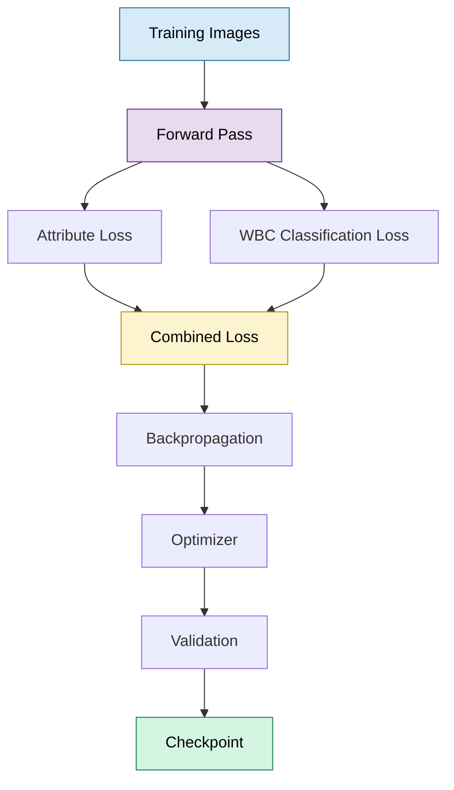
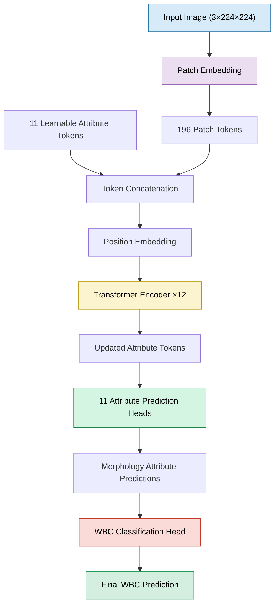

# 🩸 Explainable White Blood Cell Classification with a MAL-ViT Inspired Architecture

<p align="center">


</p>

> **An educational Computer Vision project implementing the core ideas of the MAL-ViT paper in PyTorch and extending it with a White Blood Cell (WBC) classification head for interpretable medical image analysis.**

---

# Table of Contents

1. Motivation
2. Project Goals
3. System Pipeline
4. Implementation Overview
5. Repository Highlights
6. What's Different from the Original MAL-ViT Paper
7. Repository Structure
8. Getting Started
9. Results
10. Future Work
11. References
12. Author

---

# Motivation

White Blood Cell (WBC) morphology plays an important role in diagnosing infections, inflammatory diseases, and hematological disorders.

While deep learning models can achieve high classification accuracy, many behave as black boxes, making it difficult to understand **why** a prediction was made.

The MAL-ViT paper addresses this challenge by introducing **Morphology Attribute Learning**, where a Vision Transformer learns clinically meaningful morphological attributes before producing the final prediction.

This repository was created as a learning and engineering project to better understand that architecture through implementation.

Rather than simply using an existing implementation, the project rebuilds the main components in PyTorch and adapts the overall idea to the WBCAtt dataset.

---

# Project Goals

The objectives of this repository are:

- Understand the architecture proposed in the MAL-ViT paper.
- Implement the main building blocks using PyTorch.
- Learn how Vision Transformers process medical images.
- Explore morphology-aware feature learning for WBC images.
- Extend the implementation with an additional WBC classification module.
- Build a reproducible end-to-end Computer Vision training pipeline.

This project is intended to demonstrate practical skills in:

- Computer Vision
- Vision Transformers
- PyTorch
- Deep Learning
- Multi-task Learning
- Biomedical Image Analysis

It also reflects my long-term interest in interpretable AI systems for medical imaging and serves as a foundation for future research in this area.

---

# System Pipeline


---

# Training Workflow



---

# Implementation Overview

The implementation follows the overall design philosophy presented in the **MAL-ViT** paper.

The implemented model includes:

- Vision Transformer backbone
- Patch embedding layer
- Learnable morphology attribute tokens
- Transformer encoder stack
- Independent morphology attribute prediction heads
- Multi-task training objective

In addition to these components, this project introduces an additional module that uses the predicted morphology attributes to perform final White Blood Cell classification.

The goal of this extension is to investigate whether explicit morphology predictions can serve as interpretable intermediate representations for downstream WBC classification.

---

# Repository Highlights

### Vision Transformer Fundamentals

Instead of importing an entire Vision Transformer model, the project implements the main architectural components as individual PyTorch modules, including:

- Patch Embedding
- Multi-Head Self Attention
- Feed Forward Network
- Transformer Encoder Blocks
- Positional Embeddings

This makes each component easier to study, modify, and understand.

---

### Morphology Attribute Learning

Following the idea introduced in the MAL-ViT paper, the model learns multiple morphology attributes using dedicated learnable attribute tokens rather than relying on a single classification token.

Each attribute is predicted independently before being used by the downstream classifier.

---

### WBC Classification Extension

The original MAL-ViT paper focuses on morphology attribute prediction.

This implementation additionally includes a classification head that combines attribute predictions to estimate the final White Blood Cell class.

This extension was added as part of this project and is not intended to represent the original MAL-ViT architecture.

---

### End-to-End Training Pipeline

The repository includes:

- Dataset loading
- Data augmentation
- Model training
- Validation
- Testing
- Checkpoint saving
- Metric logging

forming a complete deep learning workflow.

---

# What is Different from the Original MAL-ViT Paper?

This repository should be viewed as an **implementation inspired by the MAL-ViT paper**, rather than an official reproduction.

The overall architectural ideas are based on the publication, while certain implementation details may differ.

Additionally, this project introduces a separate WBC classification head that was added specifically for this implementation.

Where differences exist, they should be considered implementation choices rather than claims of reproducing the paper exactly.
# Model Architecture

The implementation follows the overall architectural idea presented in the **MAL-ViT (Morphology Attribute Learning Vision Transformer)** paper.

Instead of using a single `[CLS]` token like the original Vision Transformer (ViT), the model learns multiple **attribute tokens**, where each token is responsible for representing a clinically meaningful morphology attribute.

After the shared Transformer encoder, each attribute token is processed by an independent attribute prediction head.

Finally, this implementation extends the architecture by introducing an additional **White Blood Cell (WBC) classification head**, which uses the predicted morphology attributes to estimate the final WBC subtype.

> **Note**
>
> This repository is an independent educational implementation inspired by the MAL-ViT paper. While it follows the paper's overall design, implementation details may differ from the original publication.

---

# Model Architecture Diagram



---

# Model Components

## 1. Patch Embedding

The input RGB image is divided into non-overlapping image patches.

Each patch is projected into a fixed-dimensional embedding vector before entering the Transformer encoder.

Responsibilities:

- Convert images into patch tokens
- Learn low-level visual representations
- Produce a sequence of embeddings suitable for Transformer processing

---

## 2. Attribute Tokens

Instead of using a single classification token (`[CLS]`), the model uses multiple learnable attribute tokens following the idea proposed in the MAL-ViT paper.

Each token is intended to learn information related to a specific morphological characteristic of a White Blood Cell.

Examples include:

- Cell size
- Cell shape
- Nucleus shape
- Chromatin density
- Cytoplasm texture
- Granule properties

These tokens are jointly optimized with the Transformer backbone.

---

## 3. Positional Embedding

Since Transformers do not inherently understand spatial relationships, learnable positional embeddings are added to the token sequence.

This allows the model to preserve spatial information after image patches are converted into tokens.

---

## 4. Transformer Encoder

The Transformer encoder processes both:

- Patch tokens
- Attribute tokens

through multiple encoder blocks.

Each encoder block consists of:

- Layer Normalization
- Multi-Head Self Attention
- Residual Connection
- Feed Forward Network (MLP)
- Second Residual Connection

The backbone learns interactions between image patches and morphology tokens throughout the encoder.

---

## 5. Morphology Attribute Heads

Each attribute token is connected to its own prediction head.

These heads independently predict morphology-related attributes.

This multi-task learning strategy encourages the backbone to learn representations that are more interpretable than direct end-to-end classification alone.

---

## 6. WBC Classification Head

This project introduces an additional classification module that is not part of the original MAL-ViT paper.

The classifier uses the predicted morphology attributes to estimate the final White Blood Cell subtype.

Conceptually:

```
Morphology Predictions

↓

Feature Combination

↓

Fully Connected Layers

↓

WBC Prediction
```

The purpose of this module is to investigate whether morphology-aware intermediate predictions can support downstream WBC classification.

---

# Forward Pass

```text
Input Image

↓

Patch Embedding

↓

Patch Tokens

↓

Add Attribute Tokens

↓

Position Embedding

↓

Transformer Encoder

↓

Updated Attribute Tokens

↓

Attribute Prediction Heads

↓

Morphology Predictions

↓

WBC Classification Head

↓

Final WBC Prediction
```

---

# Mathematical Formulation

The following equations summarize the operations performed during inference.

## Patch Embedding

The input image is divided into image patches.

Each patch is projected into an embedding vector.

\[
z_i = W_p x_i + b
\]

where

- \(x_i\) is the flattened image patch
- \(W_p\) is the learnable projection matrix

---

## Token Construction

The Transformer input sequence is formed by combining

- Attribute Tokens
- Patch Tokens

and adding positional embeddings.

\[
T_0=[A;P]+E
\]

where

- \(A\) denotes attribute tokens
- \(P\) denotes patch embeddings
- \(E\) denotes positional embeddings

---

## Multi-Head Self Attention

Within each encoder block, attention is computed as

\[
Attention(Q,K,V)=Softmax\left(\frac{QK^T}{\sqrt{d}}\right)V
\]

where

- Q = Query
- K = Key
- V = Value

---

## Feed Forward Network

Each encoder block applies a two-layer MLP

\[
MLP(x)=W_2(GELU(W_1x))
\]

---

## Attribute Prediction

Each attribute token is mapped to its corresponding attribute prediction head.

\[
y_i=f_i(a_i)
\]

where

- \(a_i\) is an attribute token
- \(f_i\) denotes the corresponding classifier

---

## WBC Classification

The predicted morphology attributes are combined and passed to the WBC classifier.

Conceptually,

\[
y_{WBC}=g(y_1,y_2,\ldots,y_n)
\]

where

- \(g\) represents the additional classifier introduced in this project.

---

# Dataset

The model is trained using the **WBCAtt** dataset.

The dataset provides both

- White Blood Cell class labels
- Morphological attribute annotations

allowing the model to learn morphology-aware representations.

The repository includes a complete pipeline for

- CSV parsing
- Image loading
- Label encoding
- Data augmentation
- Batch generation

---

# Data Preprocessing

Training images undergo augmentation to improve generalization.

Typical preprocessing includes

- Resize
- Random Horizontal Flip
- Random Rotation
- Color Jitter
- Image Normalization

Validation and test images are processed without random augmentation.

---

# Training Configuration

The implementation includes a complete supervised training pipeline.

The training workflow consists of

- Forward propagation
- Multi-task loss computation
- Backpropagation
- Optimizer update
- Validation
- Model checkpointing

Depending on the project configuration, the training pipeline includes components such as

- AdamW optimizer
- Learning-rate scheduling
- Checkpoint saving
- Best-model selection
- Training history logging

The exact hyperparameter values can be found in the project's configuration files.

---

# Implementation Summary

| Component | Purpose |
|------------|---------|
| Patch Embedding | Convert image patches into token embeddings |
| Attribute Tokens | Learn morphology-aware representations |
| Positional Embedding | Preserve spatial information |
| Transformer Encoder | Learn global relationships between patches and attribute tokens |
| Attribute Heads | Predict morphology attributes |
| WBC Classification Head | Predict final White Blood Cell subtype |
| Multi-task Learning | Optimize attribute prediction and WBC classification jointly |
# Results

The primary objective of this project was to understand, implement, and extend the core ideas of the MAL-ViT architecture for White Blood Cell (WBC) morphology analysis.

After training, the implementation successfully learned both morphology attribute prediction and downstream WBC classification.

The repository includes:

- Training pipeline
- Validation pipeline
- Testing pipeline
- Model checkpointing
- Performance logging
- Confusion matrix generation

> The reported performance reflects this implementation on the WBCAtt dataset using the current training configuration. Results should be interpreted within the context of this implementation rather than as a direct benchmark against the original MAL-ViT paper.

---

# Repository Structure

```text
WBC-MAL-ViT/
│
├── config.py
├── train.py
├── test.py
├── inference.py
│
├── data/
│   ├── dataset.py
│   ├── dataloader.py
│   ├── transforms.py
│   └── encoders.py
│
├── models/
│   ├── patch_embedding.py
│   ├── attribute_tokens.py
│   ├── attention.py
│   ├── mlp.py
│   ├── encoder_block.py
│   ├── transformer.py
│   ├── attribute_heads.py
│   ├── wbc_classifier.py
│   ├── mal_vit.py
│   └── complete_model.py
│
├── training/
│   ├── losses.py
│   ├── trainer.py
│   ├── train_one_epoch.py
│   └── validate.py
│
├── utils/
│   ├── checkpoint.py
│   ├── logger.py
│   └── visualization.py
│
├── outputs/
│   ├── checkpoints/
│   └── logs/
│
└── notebooks/
```

---

# Getting Started

## Clone the Repository

```bash
git clone <repository-url>

cd WBC-MAL-ViT
```

---

## Install Dependencies

```bash
pip install -r requirements.txt
```

---

## Prepare the Dataset

Place the WBCAtt dataset in the directory expected by the configuration file.

Update dataset paths inside `config.py` if required.

---

## Train the Model

```bash
python train.py
```

---

## Evaluate

```bash
python test.py
```

---

## Run Inference

```bash
python inference.py --image path/to/image.jpg
```

---

# Skills Demonstrated

This repository demonstrates practical experience with

- PyTorch
- Computer Vision
- Vision Transformers
- Medical Image Analysis
- Multi-task Learning
- Deep Learning Training Pipelines
- Dataset Engineering
- Model Evaluation
- Explainable AI concepts
- Software Engineering for Machine Learning

Beyond model implementation, the project also includes the engineering components required for an end-to-end deep learning workflow, including data preparation, training, evaluation, logging, checkpointing, and inference.

---

# Limitations

Like many educational and research-oriented implementations, this project has several limitations.

- It is an independent implementation inspired by the MAL-ViT paper rather than an official reproduction.
- Certain implementation details may differ from those described in the original publication.
- The additional WBC classification head is an extension introduced in this repository.
- Explainability methods such as Grad-CAM can be further expanded in future versions.
- Additional experiments on external datasets would strengthen evaluation.

These limitations are acknowledged to maintain technical transparency.

---

# Future Work

Potential future improvements include

- Grad-CAM visualizations
- Attention Rollout
- External dataset evaluation
- Hyperparameter optimization
- Ablation studies
- Comparison against CNN-based baselines
- Comparison against pretrained Vision Transformers
- Self-supervised pretraining
- Clinical interpretation of predicted morphology attributes

This repository is intended to serve as a foundation for exploring interpretable deep learning methods for hematology image analysis.

---

# Comparison with Standard Vision Transformer

| Feature | Standard ViT | This Implementation |
|-----------|--------------|--------------------|
| Patch Embedding | ✓ | ✓ |
| Positional Embedding | ✓ | ✓ |
| Transformer Encoder | ✓ | ✓ |
| Multi-Head Self Attention | ✓ | ✓ |
| Feed Forward Network | ✓ | ✓ |
| Single CLS Token | ✓ | ✗ |
| Multiple Attribute Tokens | ✗ | ✓ (following the MAL-ViT concept) |
| Morphology Attribute Prediction | ✗ | ✓ |
| Multi-task Learning | ✗ | ✓ |
| Additional WBC Classification Head | ✗ | ✓ (project extension) |

---

# References

If you use this repository for learning or research, please also refer to the original works that inspired this implementation.

### Vision Transformer (ViT)

Dosovitskiy, A., et al.

**An Image is Worth 16x16 Words: Transformers for Image Recognition at Scale**

ICLR 2021

---

### MAL-ViT

**Morphology Attribute Learning Vision Transformer (MAL-ViT)**

This project follows the overall architectural ideas presented in the MAL-ViT paper while providing an independent PyTorch implementation and an additional WBC classification module.

Please refer to the original publication for the official architecture and experimental methodology.

---

# Author

## Muhammad Fassi Ur Rehman

**BS Artificial Intelligence**

COMSATS University Islamabad

### Interests

- Computer Vision
- Medical Image Analysis
- Vision Transformers
- Explainable AI (XAI)
- Deep Learning
- Biomedical AI

This project reflects my interest in developing interpretable computer vision systems for medical imaging and serves as part of my learning journey toward future research in AI for healthcare.

---

# Acknowledgements

I would like to acknowledge the authors of the MAL-ViT paper for introducing the morphology attribute learning framework that inspired this implementation.

I also appreciate the researchers and maintainers of the WBCAtt dataset for making annotated White Blood Cell morphology data available to the research community.

---

<p align="center">

⭐ If you found this repository useful, consider giving it a star.

I welcome feedback, discussions, and suggestions for improving the implementation.

</p>