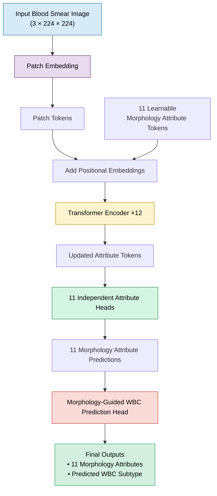
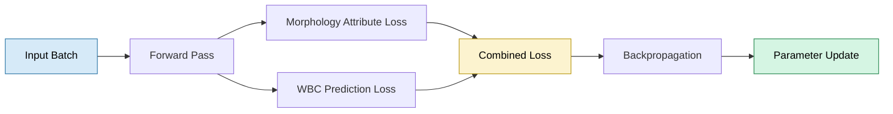

# 🩸 WBC Morphology Analysis with a MAL-ViT Inspired Architecture

<p align="center">


</p>

> **A PyTorch implementation inspired by the MAL-ViT paper for learning clinically meaningful White Blood Cell morphology attributes and extending them with a downstream morphology-guided WBC recognition module.**

---

# 📖 Overview

White Blood Cell (WBC) morphology provides valuable diagnostic information for many hematological disorders. Rather than predicting only the final cell category, this project explores a **morphology-first learning strategy**, where the model first learns interpretable morphological characteristics and then leverages those learned representations for downstream WBC recognition.

The implementation is inspired by the **Morphology Attribute Learning Vision Transformer (MAL-ViT)** paper and adapts its core architectural ideas using PyTorch.

As an extension, this project introduces an additional downstream module that utilizes the predicted morphology attributes for WBC recognition, providing a complete end-to-end learning pipeline.

> **Implementation Note**
>
> This repository is an independent educational implementation inspired by the MAL-ViT paper. It follows the paper's overall design philosophy but is **not an official reproduction**, and some implementation details may differ.

---

# 📝 Implementation at a Glance

| Category | Details |
|-----------|---------|
| 📄 Inspiration | MAL-ViT (Morphology Attribute Learning Vision Transformer) |
| 🩸 Task | Morphology Attribute Learning and Morphology-Guided WBC Recognition |
| 🧬 Input | RGB Blood Smear Images (224 × 224) |
| 📊 Outputs | 11 Morphology Attributes + WBC Prediction |
| 🧠 Backbone | Vision Transformer (ViT-inspired) |
| 🎯 Learning Strategy | Multi-Task Learning |
| ➕ Project Extension | Downstream morphology-guided WBC recognition module |
| 🧪 Dataset | WBCAtt |
| ⚙️ Framework | PyTorch |

---

# ✨ Key Features

| Feature | Description |
|---------|-------------|
| 🧬 Morphology Attribute Learning | Learns 11 clinically meaningful morphology attributes using dedicated attribute tokens. |
| 🏗️ Transformer from Modular Components | Patch embedding, attention, encoder blocks and prediction heads are implemented as reusable PyTorch modules. |
| 🔍 Multi-Task Learning | Simultaneously learns morphology attributes while optimizing downstream WBC recognition. |
| ➕ Morphology-Guided Extension | Extends the MAL-ViT concept with an additional module that uses predicted morphology for WBC recognition. |
| 📈 End-to-End Pipeline | Includes preprocessing, training, validation, testing, checkpointing and inference. |
| 📚 Educational Implementation | Built to understand and study modern Vision Transformer architectures for biomedical imaging. |

---

# 🏗️ End-to-End Pipeline


---

# 🎯 Project Objectives

- Implement the core ideas proposed in the MAL-ViT paper using PyTorch.
- Understand how morphology attribute learning can improve representation learning.
- Study Vision Transformers for biomedical image analysis.
- Extend the architecture with a morphology-guided downstream prediction module.
- Build a complete, reproducible deep learning training pipeline.

---

# 📂 What's Included

| Module | Status |
|---------|:------:|
| Patch Embedding | ✅ |
| Learnable Attribute Tokens | ✅ |
| Transformer Encoder | ✅ |
| Morphology Attribute Heads | ✅ |
| Multi-Task Learning | ✅ |
| Morphology-Guided WBC Module | ✅ |
| Training & Validation Pipeline | ✅ |
| Inference Pipeline | ✅ |

---

# 📚 Resources

| Resource | Link |
|----------|------|
| 📄 MAL-ViT Paper | https://arxiv.org/pdf/2402.08070v2 |
| 🧬 WBCAtt Dataset | https://rose1.ntu.edu.sg/dataset/WBCAtt/ |

---

# 📑 Repository Guide

- Architecture Overview
- Model Components
- Mathematical Formulation
- Dataset
- Training Pipeline
- Results
- Repository Structure
- Installation
- Future Work
- References

---

# 🏛️ Architecture Overview

This implementation follows the overall design philosophy introduced in the **MAL-ViT** paper, where learnable **morphology attribute tokens** interact with image patches throughout a Vision Transformer encoder.

Unlike a standard Vision Transformer that predicts only a final class, this model first learns **11 clinically meaningful morphology attributes** and then uses these learned representations to predict the corresponding **White Blood Cell subtype**.

The downstream WBC prediction module is an extension introduced in this project.

---

# 🔄 Model Workflow



---

# 🧩 Architecture Components

| Component | Role |
|-----------|------|
| **Patch Embedding** | Converts the input image into a sequence of patch embeddings. |
| **Morphology Attribute Tokens** | Eleven learnable tokens that capture morphology-specific information throughout the Transformer encoder. |
| **Positional Embeddings** | Preserve spatial relationships between image patches. |
| **Transformer Encoder** | Learns contextual interactions between image patches and morphology attribute tokens. |
| **11 Attribute Heads** | Independently predict the morphology attributes annotated in the WBCAtt dataset. |
| **Morphology-Guided WBC Head** | Uses the learned morphology representations to predict the final WBC subtype. |

---

# ⚙️ Forward Pass

```text
Input Blood Smear Image
           │
           ▼
     Patch Embedding
           │
           ▼
      Patch Tokens
           │
           ▼
+ 11 Morphology Attribute Tokens
           │
           ▼
    Positional Embeddings
           │
           ▼
  Transformer Encoder
           │
           ▼
 Updated Attribute Tokens
           │
           ▼
11 Attribute Prediction Heads
           │
           ▼
11 Morphology Attribute Predictions
           │
           ▼
Morphology-Guided WBC Head
           │
           ▼
Final Outputs
 ├── 11 Morphology Attributes
 └── Predicted WBC Subtype
```

---

# 📐 Mathematical Formulation

| Stage | Formulation |
|--------|-------------|
| Patch Embedding | \(z_i = W_p x_i + b\) |
| Token Construction | \(T_0 = [A;P] + E\) |
| Multi-Head Self-Attention | \(Attention(Q,K,V)=Softmax(\frac{QK^T}{\sqrt{d}})V\) |
| Feed Forward Network | \(MLP(x)=W_2(GELU(W_1x))\) |
| Morphology Prediction | \(y_i=f_i(a_i)\) |
| WBC Prediction | \(y_{wbc}=g(y_1,y_2,\ldots,y_{11})\) |

---

# 📊 Model Outputs

From a single White Blood Cell image, the model produces two sets of predictions:

| Output | Description |
|--------|-------------|
| **Morphology Attributes** | Predicts the **11 morphology attributes** annotated in the WBCAtt dataset. |
| **WBC Subtype** | Uses the predicted morphology information to estimate the corresponding White Blood Cell subtype. |

This two-stage prediction strategy is intended to encourage morphology-aware feature learning while providing intermediate predictions that are easier to interpret than end-to-end classification alone.

---

---

# 📦 Dataset

This implementation is trained and evaluated on the **WBCAtt** dataset, which provides both **White Blood Cell subtype labels** and **morphology attribute annotations**. This dual annotation enables the model to jointly learn interpretable morphology representations and downstream WBC recognition.

| Property | Details |
|----------|---------|
| **Dataset** | WBCAtt |
| **Image Type** | Peripheral Blood Smear Images |
| **Input Size** | 224 × 224 RGB |
| **Supervision** | 11 Morphology Attributes + WBC Subtype |
| **Learning Strategy** | Multi-Task Learning |

🔗 **Dataset**

https://rose1.ntu.edu.sg/dataset/WBCAtt/

---

# 🧪 Data Pipeline


Training images undergo augmentation to improve model generalization, while validation and test images are processed using deterministic preprocessing.

Typical preprocessing includes:

- Resize
- Random Horizontal Flip
- Random Rotation
- Color Jitter
- Image Normalization

---

# 🎯 Training Strategy

The model is optimized using a **multi-task learning** objective.

During each training iteration, the network simultaneously learns:

- The **11 morphology attributes**
- The **final White Blood Cell subtype**

Both objectives contribute to the optimization process through a combined training loss.



---

# ⚙️ Training Pipeline

The repository provides a complete end-to-end deep learning workflow.

| Stage | Included |
|--------|:--------:|
| Dataset Loading | ✅ |
| Image Preprocessing | ✅ |
| Data Augmentation | ✅ |
| Forward Pass | ✅ |
| Multi-Task Loss Computation | ✅ |
| Backpropagation | ✅ |
| Validation | ✅ |
| Testing | ✅ |
| Model Checkpointing | ✅ |
| Inference | ✅ |

The exact optimizer, scheduler, learning rate, batch size, and other hyperparameters are defined in the project configuration files.

---

# 📈 Implementation Checklist

| Module | Status |
|---------|:------:|
| Patch Embedding | ✅ |
| Positional Embeddings | ✅ |
| Transformer Encoder | ✅ |
| Multi-Head Self-Attention | ✅ |
| Learnable Morphology Attribute Tokens | ✅ |
| 11 Attribute Prediction Heads | ✅ |
| Morphology-Guided WBC Prediction Head | ✅ |
| Multi-Task Learning | ✅ |
| Training & Evaluation Pipeline | ✅ |
| Inference Pipeline | ✅ |

---

# 📄 Relation to the MAL-ViT Paper

| Component | This Implementation |
|-----------|:-------------------:|
| Patch Embedding | ✅ |
| Morphology Attribute Tokens | ✅ |
| Transformer Encoder | ✅ |
| Independent Attribute Heads | ✅ |
| Multi-Task Learning | ✅ |
| Educational PyTorch Implementation | ✅ |
| Morphology-Guided WBC Prediction Module | ⭐ Project Extension |

> **Transparency**
>
> This repository is an independent educational implementation inspired by the MAL-ViT paper. It follows the paper's overall architectural concepts while introducing an additional downstream morphology-guided WBC prediction module. It should not be considered an official reproduction of the original work.

---

# 📊 Results

The primary objective of this project was to understand, implement, and extend the core ideas of the **MAL-ViT** architecture for morphology-aware White Blood Cell analysis.

The repository provides a complete workflow from data preprocessing to inference while jointly predicting morphology attributes and WBC subtype.

| Capability | Status |
|------------|:------:|
| Model Training | ✅ |
| Validation | ✅ |
| Testing | ✅ |
| Checkpoint Saving | ✅ |
| Inference | ✅ |
| Performance Logging | ✅ |

> **Note**
>
> The reported results correspond to this implementation and training configuration. They should not be interpreted as a direct benchmark or reproduction of the original MAL-ViT paper.

---

# 📁 Repository Structure

```text
WBC-Morphology-Analysis/
│
├── configs/
├── data/
├── models/
├── training/
├── utils/
├── outputs/
│
├── train.py
├── test.py
├── inference.py
├── requirements.txt
└── README.md
```

---

# 🚀 Getting Started

## Clone the Repository

```bash
git clone https://github.com/<username>/<repository>.git

cd <repository>
```

## Install Dependencies

```bash
pip install -r requirements.txt
```

## Download Dataset

Download the **WBCAtt** dataset and update the dataset path in the project configuration.

## Train

```bash
python train.py
```

## Evaluate

```bash
python test.py
```

## Inference

```bash
python inference.py --image path/to/image.jpg
```

---

# 💻 Skills Demonstrated

| Area | Skills |
|------|--------|
| Deep Learning | PyTorch, Neural Network Training |
| Computer Vision | Vision Transformers, Image Representation Learning |
| Medical AI | WBC Morphology Analysis |
| Transformer Design | Patch Embedding, Self-Attention, Encoder Blocks |
| Multi-task Learning | Joint Attribute & WBC Prediction |
| Software Engineering | Modular Project Design, Training Pipeline |
| Explainability | Morphology Attribute Learning |

---

# ⚠️ Limitations

This repository aims to faithfully implement the main ideas presented in the MAL-ViT paper while remaining transparent about its scope.

Current limitations include:

- It is an independent implementation inspired by the MAL-ViT paper rather than an official reproduction.
- Some implementation details may differ from those described in the publication.
- The downstream morphology-guided WBC prediction module is an extension introduced in this project.
- Additional validation on external datasets has not yet been performed.
- Further explainability studies (e.g., Grad-CAM or Attention Rollout) can strengthen model interpretation.

---

# 🔬 Future Work

Possible future directions include:

- Grad-CAM visual explanations
- Attention Rollout visualization
- Ablation studies on attribute learning
- Evaluation on additional hematology datasets
- Comparison with pretrained Vision Transformers
- Hyperparameter optimization
- Self-supervised pretraining
- Clinical interpretation of learned morphology attributes

---

# 📚 References

| Resource | Link |
|----------|------|
| **MAL-ViT Paper** | https://arxiv.org/pdf/2402.08070v2 |
| **WBCAtt Dataset** | https://rose1.ntu.edu.sg/dataset/WBCAtt/ |
| **Vision Transformer (ViT)** | https://arxiv.org/abs/2010.11929 |

---

# 🙏 Acknowledgements

This work was inspired by the **Morphology Attribute Learning Vision Transformer (MAL-ViT)** framework and the publicly available **WBCAtt** dataset.

I would like to thank the authors of the MAL-ViT paper and the creators of the WBCAtt dataset for enabling further exploration of interpretable AI techniques for hematology image analysis.

---

# 👨‍💻 Author

## Muhammad Fassi Ur Rehman

**BS Artificial Intelligence**  
COMSATS University Islamabad

### Research Interests

- Computer Vision
- Medical Image Analysis
- Vision Transformers
- Explainable AI (XAI)
- Deep Learning
- AI for Healthcare

---

<div align="center">

### ⭐ If you found this repository useful, consider giving it a star.

I welcome feedback, suggestions, and discussions related to medical computer vision, Vision Transformers, and morphology-aware learning.

</div>