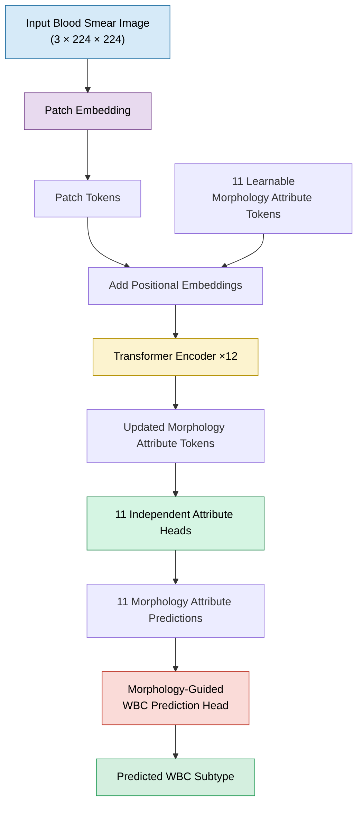
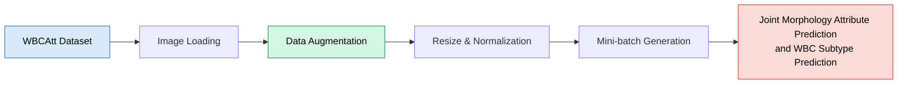
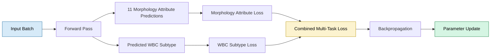

# 🩸 WBC Morphology Analysis with a MAL-ViT Inspired Architecture

<p align="center">


</p>

> **An educational PyTorch implementation inspired by the MAL-ViT paper for joint morphology attribute prediction and White Blood Cell (WBC) subtype prediction. The architecture learns 11 clinically meaningful morphology attribute predictions before using them in a Morphology-Guided WBC Prediction Head to infer the final WBC subtype.**

---

# 📖 Overview

WBC morphology carries clinically relevant information beyond the final cell subtype alone. Inspired by the **Morphology Attribute Learning Vision Transformer (MAL-ViT)**, this project adopts a **morphology-first learning strategy**: the model first predicts **11 clinically meaningful morphology attributes** from a blood smear image, then a **Morphology-Guided WBC Prediction Head** uses those intermediate predictions to infer the WBC subtype.

Implemented from scratch in **PyTorch** with a modular pipeline (dataset prep, training, evaluation, checkpointing, inference), this repository is an educational implementation for understanding morphology-aware Vision Transformers and a foundation for further research.

> **Implementation Note** — This is an independent educational implementation inspired by the MAL-ViT paper. It follows the paper's design philosophy but is **not an official reproduction**; some implementation details may differ.

---

# 📝 Implementation at a Glance

| Category | Details |
|-----------|---------|
| 📄 Inspiration | Morphology Attribute Learning Vision Transformer (MAL-ViT) |
| 🩸 Task | Joint Morphology Attribute Prediction and WBC Subtype Prediction |
| 🧬 Input | RGB Blood Smear Images (224 × 224) |
| 📊 Outputs | 11 Morphology Attribute Predictions + Predicted WBC Subtype |
| 🧠 Backbone | Vision Transformer (ViT-inspired) |
| 🎯 Learning Strategy | Multi-Task Learning |
| ➕ Project Extension | Morphology-Guided WBC Prediction Head |
| 🧪 Dataset | WBCAtt |
| ⚙️ Framework | PyTorch |
---


# ✨ Key Features

| Feature | Description |
|---------|-------------|
| 🧬 **Morphology-First Learning** | Predicts 11 clinically meaningful morphology attributes before inferring the final WBC subtype. |
| 🧠 **ViT-Inspired Architecture** | Implements the core design principles of MAL-ViT using a Vision Transformer backbone built in PyTorch. |
| 🏷️ **Learnable Morphology Attribute Tokens** | Dedicated attribute tokens interact with image patches to learn morphology-aware representations. |
| 🎯 **Joint Multi-Task Learning** | Simultaneously optimizes morphology attribute prediction and WBC subtype prediction. |
| ➕ **Morphology-Guided WBC Prediction Head** | Project extension that uses morphology attribute predictions to infer the final WBC subtype. |
| 🏗️ **Modular PyTorch Implementation** | Reusable modules for patch embedding, attention, transformer blocks, prediction heads, training, and inference. |
| 📈 **End-to-End Training Pipeline** | Data preprocessing, augmentation, training, validation, testing, checkpointing, metric logging, and inference. |
| 🔬 **Research-Oriented Design** | Built for experimentation with morphology-aware representation learning and medical image analysis. |

---

# 🏗️ End-to-End Pipeline

```mermaid
flowchart LR

A["Blood Smear Image"]

B["Image Preprocessing"]

C["Patch Embedding"]

D["11 Learnable<br/>Morphology Attribute Tokens"]

E["Transformer Encoder"]

F["11 Morphology Attribute Predictions"]

G["Morphology-Guided<br/>WBC Prediction Head"]

H["Predicted WBC Subtype"]

A --> B
B --> C
C --> D
D --> E
E --> F
F --> G
G --> H

style A fill:#D6EAF8,stroke:#2471A3,color:#000
style C fill:#E8DAEF,stroke:#6C3483,color:#000
style E fill:#FCF3CF,stroke:#B7950B,color:#000
style F fill:#D5F5E3,stroke:#1E8449,color:#000
style G fill:#FADBD8,stroke:#C0392B,color:#000
style H fill:#D4EFDF,stroke:#239B56,color:#000
```



---

# 🎯 Project Objectives

- Implement the core architectural concepts proposed in the MAL-ViT paper using PyTorch.
- Study morphology-aware representation learning with Vision Transformers.
- Jointly predict morphology attributes and WBC subtypes through a multi-task learning framework.
- Extend the original architecture with a **Morphology-Guided WBC Prediction Head**.
- Build a complete, modular, and reproducible deep learning pipeline for biomedical image analysis.

---

# 📂 What's Included

| Module | Status |
|---------|:------:|
| Patch Embedding | ✅ |
| Learnable Morphology Attribute Tokens | ✅ |
| Transformer Encoder | ✅ |
| Independent Morphology Attribute Heads | ✅ |
| Joint Multi-Task Learning | ✅ |
| Morphology-Guided WBC Prediction Head | ✅ |
| Training & Validation Pipeline | ✅ |
| Testing & Inference Pipeline | ✅ |

---

# 📚 Resources

| Resource | Link |
|----------|------|
| 📄 MAL-ViT Paper | https://arxiv.org/pdf/2402.08070v2 |
| 🧬 WBCAtt Dataset | https://rose1.ntu.edu.sg/dataset/WBCAtt/ |

---

# 📑 Repository Guide

- Architecture Overview
- Model Workflow
- Architecture Components
- Forward Pass
- Dataset
- Data Pipeline
- Training Strategy
- Training Pipeline
- Implementation Checklist
- Relation to the MAL-ViT Paper
- Results
- Repository Structure
- Getting Started
- Skills Demonstrated
- Limitations
- Future Work
- References

---

# 🏛️ Architecture Overview

The architecture follows the **MAL-ViT** design philosophy by replacing the conventional classification token with **11 learnable morphology attribute tokens**. The network first produces **11 Morphology Attribute Predictions**, which the **Morphology-Guided WBC Prediction Head**—introduced in this project—uses to produce the **Predicted WBC Subtype**. This two-stage design enables morphology-aware learning with interpretable intermediate predictions.

---

# 🔄 Model Workflow



---

# 🧩 Architecture Components

| Component | Purpose |
|-----------|---------|
| **Patch Embedding** | Splits the input image into fixed-size patches and projects them into embedding vectors. |
| **Morphology Attribute Tokens** | Eleven learnable tokens that capture morphology-specific representations during Transformer encoding. |
| **Positional Embeddings** | Preserve the spatial arrangement of image patches within the token sequence. |
| **Transformer Encoder** | Learns contextual relationships between image patches and morphology attribute tokens through self-attention. |
| **Independent Attribute Heads** | Produce the **11 Morphology Attribute Predictions** from the corresponding attribute tokens. |
| **Morphology-Guided WBC Prediction Head** | Uses the predicted morphology attribute representations to infer the **Predicted WBC Subtype**. |

---

# ⚙️ Forward Pass

```text
Input Blood Smear Image
           │
           ▼
     Patch Embedding
           │
           ▼
      Patch Tokens
           │
           ▼
+ 11 Morphology Attribute Tokens
           │
           ▼
    Positional Embeddings
           │
           ▼
  Transformer Encoder
           │
           ▼
Updated Morphology Attribute Tokens
           │
           ▼
11 Independent Attribute Heads
           │
           ▼
11 Morphology Attribute Predictions
           │
           ▼
Morphology-Guided WBC Prediction Head
           │
           ▼
Predicted WBC Subtype
```

---

# 📦 Dataset


| Property | Details |
|----------|---------|
| **Dataset** | WBCAtt |
| **Domain** | White Blood Cell Morphology Analysis |
| **Image Type** | Peripheral Blood Smear Images |
| **Input Size** | 224 × 224 RGB |
| **Annotations** | 11 Morphology Attributes + WBC Subtype |
| **Learning Strategy** | Multi-Task Learning |

### Dataset Supervision

Each image provides two complementary forms of supervision:

- **11 Morphology Attribute Labels** — used to train the attribute prediction heads.
- **WBC Subtype Label** — used to train the Morphology-Guided WBC Prediction Head.

### Dataset Resource

🔗 https://rose1.ntu.edu.sg/dataset/WBCAtt/

---

# 🧪 Data Pipeline

The data pipeline prepares blood smear images for transformer-based learning. Training images are augmented to improve generalization; validation and test images use deterministic preprocessing for consistent evaluation.



### Training Preprocessing

- Resize images to **224 × 224**
- Random Horizontal Flip
- Random Rotation
- Color Jitter
- Image Normalization

### Validation and Testing

Validation and test images are processed using deterministic transformations (resize and normalization only), ensuring reported performance reflects the learned model rather than random augmentation.

---

# 🎯 Training Strategy

The model is trained using a **multi-task learning** strategy, optimizing both prediction tasks simultaneously in each iteration. Rather than treating morphology attribute prediction and WBC subtype prediction as independent problems, the architecture learns them jointly — the intermediate morphology predictions guide the downstream **Morphology-Guided WBC Prediction Head**.

### Training Objectives

For each input image, the network predicts:

- **11 Morphology Attribute Predictions**
- **Predicted WBC Subtype**

These are optimized together via a combined loss.



### Optimization Process

For each mini-batch, the model:

1. Generates **11 Morphology Attribute Predictions**.
2. Uses these within the **Morphology-Guided WBC Prediction Head** to estimate the **Predicted WBC Subtype**.
3. Computes separate losses for morphology attributes and WBC subtype prediction.
4. Combines both losses into a single optimization objective.
5. Updates all network parameters through backpropagation.

This encourages the transformer encoder to learn shared morphology-aware representations that benefit both tasks.

---

# ⚙️ Training Pipeline

The repository provides a complete end-to-end training workflow, from data loading to inference, with a modular structure that lets individual components be modified or extended independently.

| Stage | Description |
|--------|-------------|
| 📂 Dataset Loading | Loads and organizes the WBCAtt dataset for training, validation, and testing. |
| 🖼️ Image Preprocessing | Applies resizing, normalization, and data augmentation where appropriate. |
| 🧩 Patch Embedding | Converts each input image into a sequence of patch embeddings. |
| 🧠 Forward Pass | Processes patch tokens and morphology attribute tokens through the Transformer encoder. |
| 🧬 Morphology Attribute Prediction | Predicts the 11 morphology attributes using independent prediction heads. |
| 🩸 WBC Subtype Prediction | Uses the Morphology-Guided WBC Prediction Head to estimate the WBC subtype. |
| 🎯 Multi-Task Loss Computation | Combines morphology attribute loss and WBC subtype loss into a unified objective. |
| 🔄 Backpropagation | Updates all learnable parameters using gradient-based optimization. |
| ✅ Validation | Evaluates model performance on the validation dataset after each training epoch. |
| 💾 Checkpoint Saving | Saves model checkpoints for reproducibility and future evaluation. |
| 🧪 Testing | Measures final performance on the held-out test dataset. |
| 🔍 Inference | Generates predictions for previously unseen blood smear images. |

### End-to-End Workflow

```text
WBCAtt Dataset
      │
      ▼
Image Preprocessing
      │
      ▼
Patch Embedding
      │
      ▼
Transformer Encoder
      │
      ▼
11 Morphology Attribute Predictions
      │
      ▼
Morphology-Guided WBC Prediction Head
      │
      ▼
Predicted WBC Subtype
      │
      ▼
Loss Computation
      │
      ▼
Backpropagation
      │
      ▼
Model Checkpoint
      │
      ▼
Testing & Inference
```

The optimizer, learning rate scheduler, batch size, learning rate, number of epochs, and other hyperparameters are defined in the project configuration files, allowing experiments to be reproduced and modified without changing the core implementation.

---

# 📈 Implementation Checklist

| Component | Status |
|-----------|:------:|
| Patch Embedding | ✅ |
| Learnable Morphology Attribute Tokens | ✅ |
| Positional Embeddings | ✅ |
| Multi-Head Self-Attention | ✅ |
| Transformer Encoder Blocks | ✅ |
| 11 Independent Morphology Attribute Heads | ✅ |
| Morphology-Guided WBC Prediction Head | ✅ |
| Multi-Task Learning Framework | ✅ |
| Training Pipeline | ✅ |
| Validation Pipeline | ✅ |
| Testing Pipeline | ✅ |
| Inference Pipeline | ✅ |
| Model Checkpointing | ✅ |
| Configuration-Based Experiment Setup | ✅ |

### Repository Highlights

- A modular Vision Transformer architecture inspired by **MAL-ViT**.
- Learnable morphology attribute tokens for morphology-aware representation learning.
- Independent prediction heads for the **11 Morphology Attribute Predictions**.
- A **Morphology-Guided WBC Prediction Head** introduced as a project extension.
- Joint optimization through **Multi-Task Learning**.
- A complete training, validation, testing, and inference workflow.
- A configurable project structure supporting reproducible experiments and future research.

---

# 📄 Relation to the MAL-ViT Paper

This repository is an **independent educational implementation** inspired by the **Morphology Attribute Learning Vision Transformer (MAL-ViT)** paper. It follows the paper's central idea of learning morphology-aware representations through dedicated attribute tokens within a Vision Transformer, used for morphology attribute prediction.

As an extension, this project introduces a **Morphology-Guided WBC Prediction Head**, which uses the intermediate morphology predictions to perform downstream **WBC Subtype Prediction**. This module is **not part of the original MAL-ViT architecture** and was developed specifically for this implementation.

## Comparison with the Original Paper

| Component | Original MAL-ViT | This Repository |
|-----------|:----------------:|:---------------:|
| Vision Transformer Backbone | ✅ | ✅ |
| Learnable Morphology Attribute Tokens | ✅ | ✅ |
| Transformer Encoder | ✅ | ✅ |
| Independent Morphology Attribute Heads | ✅ | ✅ |
| Morphology Attribute Prediction | ✅ | ✅ |
| Educational PyTorch Implementation | ❌ | ✅ |
| Modular Project Structure | ❌ | ✅ |
| Complete Training, Validation & Testing Pipeline | ❌ | ✅ |
| Morphology-Guided WBC Prediction Head | ❌ | ⭐ Project Extension |
| Joint Morphology Attribute Prediction and WBC Subtype Prediction | ❌ | ⭐ Project Extension |

> **Transparency** — This repository should not be considered an official reproduction of the MAL-ViT paper. While it follows the paper's overall architectural concepts, some implementation details may differ. The **Morphology-Guided WBC Prediction Head** and the resulting joint prediction framework are extensions introduced specifically for this project.

## Purpose of this Repository

- Understand the architectural principles introduced by MAL-ViT.
- Provide a clean and modular PyTorch implementation for educational purposes.
- Explore morphology-aware representation learning for biomedical image analysis.
- Extend the original architecture with a downstream prediction module for joint attribute and subtype prediction.
- Provide a reproducible foundation for further research and experimentation.

---

# 📊 Results

The primary objective of this repository is to implement, understand, and extend the core concepts introduced by MAL-ViT for **Joint Morphology Attribute Prediction and WBC Subtype Prediction**, with a complete end-to-end implementation covering data preprocessing, training, evaluation, and inference.

## Current Implementation

| Capability | Status |
|------------|:------:|
| Model Training | ✅ |
| Validation | ✅ |
| Testing | ✅ |
| Inference | ✅ |
| Model Checkpointing | ✅ |
| Performance Logging | ✅ |

## Evaluation Metrics

The implementation supports standard classification metrics for evaluating both prediction tasks, including Accuracy, Precision, Recall, F1-Score, and Confusion Matrix. Additional metrics can be incorporated depending on future experimental requirements.

> **Note** — Performance obtained from this implementation reflects the chosen training configuration, dataset split, and implementation details. It should **not** be interpreted as a direct reproduction or benchmark of the original MAL-ViT paper.

---

# 📁 Repository Structure

```text
WBC-Morphology-Analysis/
├── data/                       # Dataset loading and preprocessing
│   ├── __init__.py
│   ├── dataloader.py
│   ├── dataset.py
│   ├── encoders.py
│   └── transforms.py
│
├── datasets/                   # External datasets and annotations
│   └── WBCAtt/
│       ├── annotations/
│       │   ├── pbc_attr_v1_train.csv
│       │   ├── pbc_attr_v1_val.csv
│       │   └── test.csv
│       └── PBC_dataset_normal_DIB/
│           ├── basophil/
│           ├── eosinophil/
│           ├── erythroblast/
│           ├── ig/
│           ├── lymphocyte/
│           ├── monocyte/
│           ├── neutrophil/
│           └── platelet/
│
├── models/                     # Model architecture components
│   ├── attention.py
│   ├── attribute_heads.py
│   ├── attribute_tokens.py
│   ├── complete_model.py
│   ├── encoder_block.py
│   ├── mal_vit.py
│   ├── mlp.py
│   ├── patch_embedding.py
│   ├── transformer.py
│   └── wbc_classifier.py
│
├── notebooks/                  # Jupyter notebooks for analysis
│   └── 01_dataset_analysis.ipynb
│
├── outputs/                    # Checkpoints, logs, and experiment outputs
│   ├── checkpoints/
│   │   ├── best_model.pth
│   │   └── last_checkpoint.pth
│   ├── logs/
│   │   └── training_log.csv
│   └── plots/
│
├── training/                   # Training and evaluation utilities
│   ├── early_stopping.py
│   ├── losses.py
│   ├── scheduler.py
│   ├── train_one_epoch.py
│   ├── trainer.py
│   └── validate.py
│
├── utils/                      # Helper functions and metrics
│   ├── checkpoint.py
│   ├── logger.py
│   ├── metrics.py
│   ├── seed.py
│   └── visualization.py
│
├── tests/                      # Unit and smoke tests
│   └── smoke_test.py
│
├── .gitignore
├── config.py                   # Main config file
├── train.py                    # Model training script
├── test.py                     # Model evaluation script
├── inference.py                # Single-image inference script
├── requirements.txt            # Python dependencies
└── README.md                   # Project documentation
```

The project follows a modular structure to improve readability, reproducibility, and ease of future development. Individual components can be modified or extended independently without affecting the overall training pipeline.

---

# 🚀 Getting Started

## 1. Clone the Repository

```bash
git clone https://github.com/<username>/<repository>.git
cd <repository>
```

## 2. Install Dependencies

```bash
pip install -r requirements.txt
```

## 3. Download the Dataset

Download the **WBCAtt** dataset from https://rose1.ntu.edu.sg/dataset/WBCAtt/ and update the dataset path in the project configuration.

## 4. Train the Model

```bash
python train.py
```

## 5. Evaluate the Model

```bash
python test.py
```

## 6. Run Inference

```bash
python inference.py --image path/to/image.jpg
```

---

# 💻 Skills Demonstrated

| Area | Skills Demonstrated |
|------|----------------------|
| Deep Learning | PyTorch, Neural Network Training |
| Computer Vision | Vision Transformers (ViT), Image Representation Learning |
| Medical AI | White Blood Cell Morphology Analysis |
| Model Design | Patch Embedding, Multi-Head Self-Attention, Transformer Encoder |
| Multi-Task Learning | Joint Morphology Attribute Prediction and WBC Subtype Prediction |
| Software Engineering | Modular Project Design, Configuration Management, Training Pipeline |
| Research Implementation | Paper Reproduction, Architecture Extension, Experimentation |
| Explainable AI | Morphology-Aware Representation Learning |

---

# ⚠️ Limitations

- This repository is an independent implementation inspired by the MAL-ViT paper and is **not an official reproduction**.
- Certain architectural and implementation details may differ from those described in the original publication.
- The **Morphology-Guided WBC Prediction Head** is an extension introduced specifically for this project.
- Model performance depends on the selected hyperparameters, training configuration, and dataset split.
- Additional validation on external hematology datasets is required to evaluate generalization.
- More comprehensive explainability analyses, such as Grad-CAM or Attention Rollout, remain future work.

---

# 🔬 Future Work

- Grad-CAM
- Attention Rollout
- Ablation Studies
- Hyperparameter Optimization
- Self-Supervised Pretraining
- Pretrained ViT Comparison
- Additional Hematology Datasets
- Clinical Interpretation

---

# 📚 References

| Resource | Link |
|----------|------|
| **Morphology Attribute Learning Vision Transformer (MAL-ViT)** | https://arxiv.org/pdf/2402.08070v2 |
| **WBCAtt Dataset** | https://rose1.ntu.edu.sg/dataset/WBCAtt/ |
| **An Image is Worth 16×16 Words: Transformers for Image Recognition at Scale (ViT)** | https://arxiv.org/abs/2010.11929 |

---

# 🙏 Acknowledgements

This repository was inspired by the MAL-ViT framework and developed using the publicly available WBCAtt dataset. I sincerely thank the authors of the MAL-ViT paper for introducing the morphology attribute learning framework and the creators of the WBCAtt dataset for making high-quality morphology annotations publicly available.

---

# 👨‍💻 Author

## Muhammad Fassi Ur Rehman

**BS Artificial Intelligence**
COMSATS University Islamabad

### Areas of Interest

- Computer Vision
- Medical Image Analysis
- Vision Transformers
- Explainable AI (XAI)
- Deep Learning
- Biomedical AI

---

<div align="center">

### ⭐ If you found this repository useful, consider giving it a star.

Contributions, suggestions, and discussions related to biomedical computer vision, Vision Transformers, morphology-aware learning, and explainable AI are always welcome.

</div>