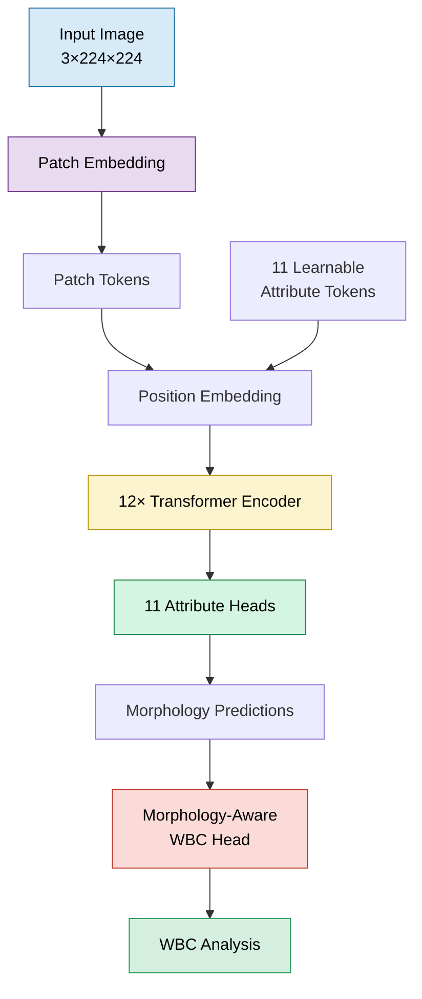
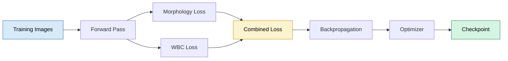

# 🩸 WBC Morphology Analysis with a MAL-ViT Inspired Architecture

<p align="center">


</p>

> **An educational PyTorch implementation inspired by the MAL-ViT paper, adapted for White Blood Cell (WBC) morphology analysis and extended with a morphology-aware WBC analysis head.**

---

## 📖 Overview

This project explores **interpretable Vision Transformers** for White Blood Cell (WBC) morphology analysis by implementing the core ideas presented in the **MAL-ViT (Morphology Attribute Learning Vision Transformer)** paper.

Instead of relying solely on end-to-end classification, the model first learns **morphological attributes** through dedicated attribute tokens and then uses these learned representations for downstream WBC analysis.

> **Note**
>
> This is an independent educational implementation inspired by the MAL-ViT paper. It aims to follow the paper's overall design philosophy but is **not an official reproduction**, and implementation details may differ.

---

## 📝 Implementation at a Glance

| Category | Details |
|----------|---------|
| 📄 Inspiration | MAL-ViT (Morphology Attribute Learning Vision Transformer) |
| 🧠 Framework | PyTorch |
| 🩸 Application | White Blood Cell Morphology Analysis |
| 🖼️ Input | RGB Blood Smear Images (224×224) |
| 🧬 Dataset | WBCAtt |
| 🏗️ Backbone | ViT-inspired Transformer |
| 🎯 Learning Strategy | Morphology Attribute Learning + Multi-task Learning |
| ➕ Project Extension | Morphology-aware WBC Analysis Head |
| 🎓 Purpose | Educational implementation to understand and extend MAL-ViT |

## ✨ Key Features

| Feature | Why It Matters |
|---------|----------------|
| 🧩 Modular PyTorch Design | Each major component is implemented as an independent module for easier understanding and experimentation. |
| 🧬 Morphology Attribute Learning | Uses learnable attribute tokens to capture morphology-aware representations following the MAL-ViT concept. |
| 🏗️ Extensible Architecture | Designed so additional analysis or classification modules can be integrated with minimal changes. |
| 📊 End-to-End Pipeline | Includes data loading, training, validation, testing, checkpointing, and inference. |
| 📖 Educational Focus | Aims to demonstrate how modern Vision Transformer architectures can be implemented from scratch in PyTorch. |

---

## 🏗️ System Pipeline

```mermaid
flowchart LR

A["Blood Smear Image"]

B["Preprocessing"]

C["Patch Embedding"]

D["Attribute Tokens"]

E["Transformer Encoder"]

F["Morphology Attribute Prediction"]

G["Morphology-Aware WBC Head"]

H["WBC Analysis Output"]

A --> B
B --> C
C --> D
D --> E
E --> F
F --> G
G --> H

style A fill:#D6EAF8,stroke:#2471A3,color:#000
style C fill:#EBDEF0,stroke:#7D3C98,color:#000
style E fill:#FCF3CF,stroke:#B7950B,color:#000
style F fill:#D5F5E3,stroke:#1E8449,color:#000
style G fill:#FADBD8,stroke:#C0392B,color:#000
style H fill:#D4EFDF,stroke:#239B56,color:#000
```



---

## 📌 Project Goals

- Implement the core ideas of the MAL-ViT architecture in PyTorch.
- Understand morphology-aware representation learning.
- Explore interpretable Vision Transformers for biomedical imaging.
- Extend the architecture with a downstream WBC analysis head.
- Build a complete Computer Vision training pipeline.

---

## 📂 Project Scope

| Included | Status |
|----------|--------|
| Patch Embedding | ✅ |
| Learnable Attribute Tokens | ✅ |
| Transformer Encoder | ✅ |
| Morphology Attribute Heads | ✅ |
| WBC Analysis Head | ✅ |
| Training Pipeline | ✅ |
| Validation & Testing | ✅ |
| Model Checkpointing | ✅ |

---

## 📚 Resources

### 📄 Original Paper

**Morphology Attribute Learning Vision Transformer (MAL-ViT)**

https://arxiv.org/pdf/2402.08070v2

---

### 🧬 Dataset

**WBCAtt Dataset**

https://rose1.ntu.edu.sg/dataset/WBCAtt/

---

## 📑 Repository Contents

- Model Architecture
- Training Pipeline
- Dataset
- Mathematical Formulation
- Results
- Project Structure
- Installation Guide
- Future Work
- References
---


# 🏛️ Architecture Overview

The implementation follows the overall design philosophy introduced in the **MAL-ViT** paper.

Instead of relying on a single **CLS token**, the model learns multiple **morphology attribute tokens** that interact with image patches throughout the Transformer encoder. These learned morphology representations are then used by an additional **WBC analysis head**, which is introduced in this project.

---

## 🔄 Model Workflow



---

# 🧩 Model Components

| Component | Purpose |
|-----------|---------|
| Patch Embedding | Converts image patches into token embeddings |
| Attribute Tokens | Learn morphology-aware representations |
| Position Embedding | Preserves spatial information |
| Transformer Encoder | Learns relationships between image patches and attribute tokens |
| Attribute Heads | Predict morphology attributes |
| WBC Analysis Head | Uses predicted morphology for downstream WBC analysis |

---

# ⚙️ Forward Pass

```text
Input Image
      │
      ▼
Patch Embedding
      │
      ▼
Patch Tokens
      │
      ▼
+ Attribute Tokens
      │
      ▼
Position Embedding
      │
      ▼
Transformer Encoder
      │
      ▼
Attribute Tokens
      │
      ▼
Attribute Prediction Heads
      │
      ▼
Morphology Predictions
      │
      ▼
Morphology-Aware WBC Head
      │
      ▼
Final WBC Analysis
```

---

# 📊 Training Pipeline



---

# 📐 Mathematical Formulation

| Stage | Equation |
|--------|----------|
| Patch Embedding | \(z_i=W_px_i+b\) |
| Token Construction | \(T=[A;P]+E\) |
| Self-Attention | \(Attention(Q,K,V)=Softmax(QK^T/\sqrt d)V\) |
| Feed Forward | \(MLP(x)=W_2(GELU(W_1x))\) |
| Attribute Prediction | \(y_i=f_i(a_i)\) |
| WBC Analysis | \(y=g(y_1,y_2,\ldots,y_n)\) |

---

# 📦 Dataset

| Property | Value |
|----------|-------|
| Dataset | WBCAtt |
| Domain | White Blood Cell Morphology |
| Input | Blood Smear Images |
| Labels | WBC Class + Morphology Attributes |
| Task | Morphology Analysis |

🔗 Dataset

https://rose1.ntu.edu.sg/dataset/WBCAtt/

---

# 🧪 Data Pipeline

```text
Dataset

↓

Image Loading

↓

Data Augmentation

↓

Normalization

↓

Mini-Batches

↓

Training
```

---

# 🚀 Training Configuration

The project provides a complete training workflow including:

- Image preprocessing
- Data augmentation
- Mini-batch loading
- Multi-task optimization
- Validation
- Model checkpointing
- Testing and inference

The exact hyperparameters (learning rate, optimizer, scheduler, epochs, etc.) are defined in the project's configuration files.

---

# 📋 Implementation Summary

| Feature | Status |
|----------|:------:|
| Patch Embedding | ✅ |
| Transformer Encoder | ✅ |
| Multi-Head Self Attention | ✅ |
| Learnable Attribute Tokens | ✅ |
| Morphology Attribute Heads | ✅ |
| Multi-task Learning | ✅ |
| Morphology-Aware WBC Head | ✅ |
| End-to-End Training Pipeline | ✅ |

---

# 📖 Relation to the Original MAL-ViT Paper

| Original MAL-ViT | This Repository |
|------------------|-----------------|
| Morphology Attribute Tokens | ✅ Implemented |
| Shared Transformer Encoder | ✅ Implemented |
| Independent Attribute Heads | ✅ Implemented |
| Educational PyTorch Implementation | ✅ |
| Additional Morphology-Aware WBC Head | ✅ Extension in this project |

> **Transparency**
>
> This repository should be viewed as an educational implementation inspired by the MAL-ViT paper. While it follows the paper's overall architectural ideas, some implementation details may differ, and the additional WBC analysis head is an extension introduced specifically for this project.

---

# 📊 Results

The primary goal of this project was to understand, implement, and extend the core ideas behind the **MAL-ViT** architecture for White Blood Cell morphology analysis.

The repository includes a complete pipeline for:

| Module | Status |
|---------|:------:|
| Model Training | ✅ |
| Validation | ✅ |
| Testing | ✅ |
| Checkpoint Saving | ✅ |
| Metric Logging | ✅ |
| Inference | ✅ |

> **Note:** Results obtained from this implementation should not be interpreted as a direct reproduction of the original MAL-ViT paper, since implementation details and the downstream WBC analysis module differ.

---

# 📁 Repository Structure

```text
WBC-MAL-ViT/
│
├── config.py
├── train.py
├── test.py
├── inference.py
│
├── data/
├── models/
├── training/
├── utils/
├── outputs/
├── notebooks/
└── README.md
```

---

# 🚀 Getting Started

## 1. Clone the Repository

```bash
git clone https://github.com/<your-username>/<repo-name>.git

cd <repo-name>
```

---

## 2. Install Dependencies

```bash
pip install -r requirements.txt
```

---

## 3. Download the Dataset

Download the **WBCAtt** dataset from:

🔗 https://rose1.ntu.edu.sg/dataset/WBCAtt/

Update the dataset path in `config.py`.

---

## 4. Train

```bash
python train.py
```

---

## 5. Evaluate

```bash
python test.py
```

---

## 6. Run Inference

```bash
python inference.py --image path/to/image.jpg
```

---

# 💡 Skills Demonstrated

| Area | Technologies / Concepts |
|------|--------------------------|
| Deep Learning | PyTorch |
| Computer Vision | Vision Transformers (ViT) |
| Medical Imaging | WBC Morphology Analysis |
| Model Design | Transformer Encoder, Attribute Tokens |
| Training | Multi-task Learning |
| Engineering | Modular PyTorch Project Structure |
| AI | Explainable AI (XAI) Fundamentals |

---

# ⚖️ Limitations

This repository is intended as an educational implementation.

Some important considerations:

- It is **inspired by** the MAL-ViT paper rather than an official reproduction.
- Some implementation details may differ from the original publication.
- The morphology-aware WBC analysis head is an extension introduced in this project.
- Performance depends on the chosen training configuration and dataset split.

---

# 🔮 Future Work

Potential improvements include:

- 🎯 Grad-CAM visualization
- 🎯 Attention Rollout
- 🎯 Hyperparameter optimization
- 🎯 External dataset evaluation
- 🎯 Ablation studies
- 🎯 Comparison with pretrained ViTs
- 🎯 Clinical interpretation of morphology attributes

---

# 📚 References

## 📄 MAL-ViT Paper

**Morphology Attribute Learning Vision Transformer (MAL-ViT)**

**Paper**

https://arxiv.org/pdf/2402.08070v2

---

## 🧬 WBCAtt Dataset

**White Blood Cell Morphology Dataset**

https://rose1.ntu.edu.sg/dataset/WBCAtt/

---

## 📖 Vision Transformer

Dosovitskiy et al.

**An Image is Worth 16×16 Words: Transformers for Image Recognition at Scale**

ICLR 2021

https://arxiv.org/abs/2010.11929

---

# 🙏 Acknowledgements

This project was inspired by the **MAL-ViT** architecture proposed by its original authors.

Special thanks to the creators of the **WBCAtt** dataset for providing publicly available White Blood Cell morphology annotations that make educational implementations and research possible.

---

# 👨‍💻 Author

## Muhammad Fassi Ur Rehman

**BS Artificial Intelligence**

COMSATS University Islamabad

### Interests

- 🤖 Artificial Intelligence
- 👁️ Computer Vision
- 🧬 Medical Image Analysis
- 🔍 Explainable AI (XAI)
- 🧠 Vision Transformers
- ❤️ AI for Healthcare

---

## ⭐ If You Find This Repository Useful

If this project helps your learning or research, consider giving it a ⭐.

Feedback, suggestions, and discussions are always welcome.

---

<p align="center">

<b>Learning • Implementing • Exploring Explainable Computer Vision for Medical Imaging</b>

</p>